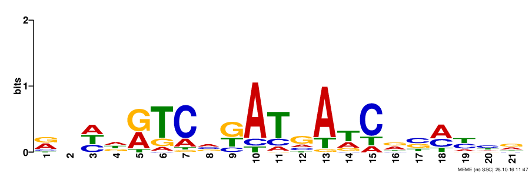
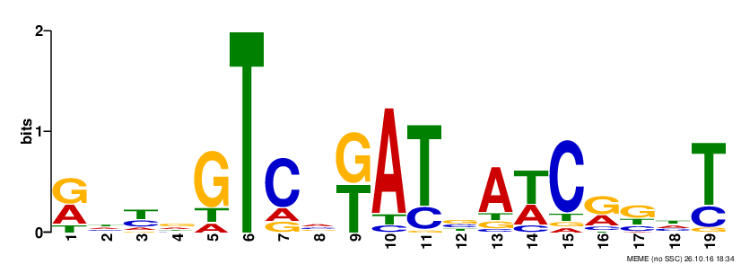
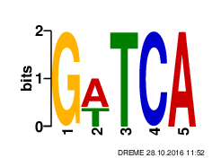

---
title: "Notebook - motif discovery for WhiH"
author: "SG"
date: "November 01, 2016"
output:
  html_document:
    theme: readable
    css: style.css
    toc: true
    toc_depth: 3
    toc_float: true
---
<link href="style.css" rel="stylesheet">

```{r setup, include=FALSE}
knitr::opts_chunk$set(echo = TRUE)
```

This is description of results obtained during motif discovery after extracting sequence regions from S. venezuelae genome [(Gen-Bank accession number NC_018750)](https://www.ncbi.nlm.nih.gov/nuccore/NC_018750) based on ChIP-seq peak data. Full project description can be found  [here](https://docs.google.com/document/d/1ovCNDeNRCVAEbYnFg1xPN2Wg67dJ2bQ9shSsmo14nLc/edit)

***
# Results & Notes
## 2016-11-14 Comparison of all peaks and top 10% most significant peaks motifs

### Preparation of input for MEME
Input for [MEME-ChIP](http://meme-suite.org/tools/meme-chip) was generated via same python script (*seq_extractor.py*), with same settings (*length 500 with the peak in the middle*) except input peaks tab-file.  
Command for all peaks regions generation:
```
$python3 bin/seq_extractor.py -l 500 -g data/2016-10-26_Check/FR845719_1.fasta -i data/WhiH_regulon_FLAG_All.csv
```
Command for 10% of most significant peaks regions generation:
```
$python3 bin/seq_extractor.py -l 500 -g data/2016-10-26_Check/FR845719_1.fasta -i data/WhiH_regulon_FLAG_Top10per.csv
```

***

### MEME-Chip input settings
All defaults, except *Input the motifs section* - selection:  
> Prokaryote DNA  
> Combined Prokaryotes


#### Citations from [MEME-ChIP tutorial](http://www.nature.com/nprot/journal/v9/n6/full/nprot.2014.083.html):  

> MEME-ChIP uses two de novo motif discovery algorithms with complementary strengths and weaknesses: MEME is highly specific but slower, whereas DREME is less specific but faster. The algorithms are coupled with a motif enrichment algorithm, CentriMo, which is highly sensitive but operates only on previously identified motifs. MEME-ChIP synthesizes the results of these three algorithms by clustering the discovered and enriched motifs according to their similarity.

***

### MEME-ChIP output

Category | All Peaks ranges (349 peaks) | Top 10% significant (36 peaks)
---------|------------------------------|-------------------------------
MEME Motifs | [](2016-10-28/all_peaks_MEME_chip/meme-chip.html) | [](2016-10-26/top_10_MEME_chip/meme-chip.html)
e-value | **1.6e-64** | 4.2e-33
**CentriMo results** |  [link](2016-10-28/all_peaks_MEME_chip/centrimo_out/centrimo.html) | [link](2016-10-26/top_10_MEME_chip/centrimo_out/centrimo.html) 
E-value | **7.6e-60** | 3.2e-20
Region Matches | 170 out of 349 (49%) | **30 out of 36 (83%)**
~~**DREME results**~~ | [](2016-10-28/all_peaks_MEME_chip/dreme_out/dreme.html) | N/A
~~**TOMTOM results**~~ | [link](2016-10-28/all_peaks_MEME_chip/dreme_tomtom_out/tomtom.html) | N/A
**FIMO results** (to be evaluated)| [link](2016-10-28/all_peaks_MEME_chip/fimo_out_1/fimo.html) | [link](2016-10-26/top_10_MEME_chip/fimo_out_1/fimo.html)
**SpaMo results** (to be evaluated)| [link](2016-10-28/all_peaks_MEME_chip/spamo_out_1/spamo.html) | [link](2016-10-26/top_10_MEME_chip/spamo_out_1/spamo.html)

### Previous motiff based on DNaseI footprinting


***

## 2016-11-17 Review with Klas

* DREME results should be disregarded, because of very low significance and no real match with MEME motif.
* Another DREME run can be done with 50 - 100 ranges just to check if result is better
* Reverse motif from top-10% peaks is almost identical to both all-peaks MEME motif and motif discovered from DNaseI foot-printing

# Next steps

Last update: 2016-11-16   

* review all the tutorials and examples for MEME-ChIP and define set of optimal settings for final test
* perform analysis of the same data with other suit, e.g. ChIPMunk
* check possibility to convert discovered motifs into HMM-profile (contact Markus)
* get statistical data on motif abundance (specificity) in total genome (with HMM-profile if possible)
* clarify Transcriptomics data and ways to analyse it:
  * compare available transcriptomics data for most significant motif based positions with non significant
