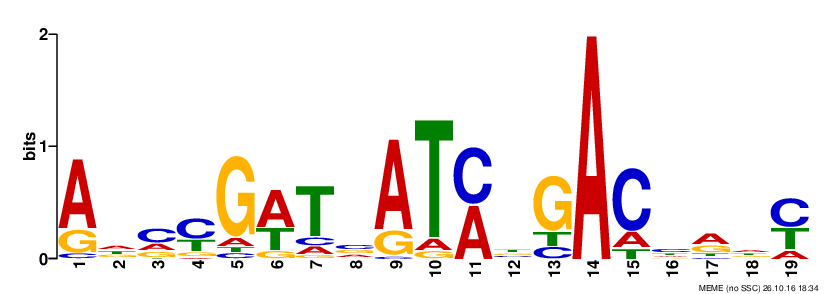

```{r setup, include=FALSE}
knitr::opts_chunk$set(echo = TRUE)
```

# Motif discovery for WhiH 

This is description of results obtained during motif discovery after extracting sequence regions from S. venezuelae genome [(Gen-Bank accession number NC_018750)](https://www.ncbi.nlm.nih.gov/nuccore/NC_018750) based on ChIP-seq peak data.

***
### 2016-11-14 Comparison of all peaks and top 10% most significant peaks motifs

Input for [MEME-ChIP](http://meme-suite.org/tools/meme-chip) was generated via same python script (*seq_extractor.py*), with same settings (*500 bp with the peak in the middle*) except peaks tab-file.
Command for all peaks regions generation:
```
>python3 bin/seq_extractor.py -l 500 -g data/2016-10-26_Check/FR845719_1.fasta -i data/WhiH_regulon_FLAG_All.csv
```
Command for 10% of most significant peaks regions generation:
```
>python3 bin/seq_extractor.py -l 500 -g data/2016-10-26_Check/FR845719_1.fasta -i data/WhiH_regulon_FLAG_Top10per.csv
```
***
#### MEME-ChIP output
Category | All Peaks ranges (349 peaks) | Top 10% significant (36 peaks)
---------|------------------------------|-------------------------------
Motifs |  | 
e-value | **1.6e-64** | 4.2e-33
**CentriMo results** |  ... | ... 
E-value | **7.6e-60** | 3.2e-20
Region Width | 66 | 46
Region Matches | 170 out of 349 (49%) | **30 out of 36 (83%)**
MEME-ChIP Results links | [all peaks](2016-10-28/all_peaks_MEME_chip/meme-chip.html) | [top10](2016-10-26/top_10_MEME_chip/meme-chip.html)

#### Previous motiff based on DNaseI footprinting


***

## Next steps section

Last update: 2016-11-15

* check possibility to convert discovered motifs into HMM-profile (contact Markus)
* get statistical data on motif abundance (specificity) in total genome (with HMM-profile if possible)
* clarify Transcriptomics data and ways to analyse it
