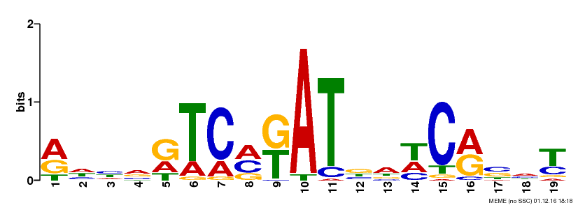
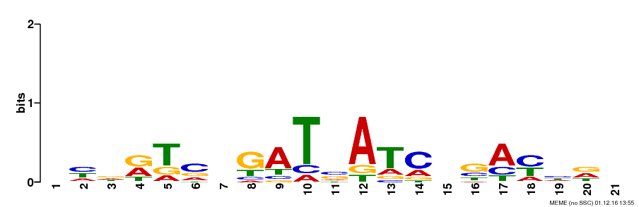

---
title: "Notebook - motif discovery for WhiH"
author: "SG"
date: "November 01, 2016"
output:
  html_document:
    css: style.css
    toc: true
    toc_depth: 3
    toc_float: true
---
<link href="style.css" rel="stylesheet">

```{r setup, include=FALSE}
knitr::opts_chunk$set(echo = TRUE)
```

This is description of results obtained during motif discovery after extracting sequence regions from S. venezuelae genome [(Gen-Bank accession number NC_018750)](https://www.ncbi.nlm.nih.gov/nuccore/NC_018750) based on ChIP-seq peak data. Full project description can be found  [here](https://docs.google.com/document/d/1ovCNDeNRCVAEbYnFg1xPN2Wg67dJ2bQ9shSsmo14nLc/edit)

***
# Results & Notes
## 2016-11-14 Comparison of all peaks and top 10% most significant peaks motifs

### Preparation of input for MEME
Input for [MEME-ChIP](http://meme-suite.org/tools/meme-chip) was generated via same python script (*seq_extractor.py*), with same settings (*length 500 with the peak in the middle*) except input peaks tab-file.  
Command for all peaks regions generation:
```
$python3 bin/seq_extractor.py -l 500 -g data/2016-10-26_Check/FR845719_1.fasta -i data/WhiH_regulon_FLAG_All.csv
```
Command for 10% of most significant peaks regions generation:
```
$python3 bin/seq_extractor.py -l 500 -g data/2016-10-26_Check/FR845719_1.fasta -i data/WhiH_regulon_FLAG_Top10per.csv
```

***

### MEME-Chip input settings
All defaults, except *Input the motifs section* - selection:  
> Prokaryote DNA  
> Combined Prokaryotes


#### Citations from [MEME-ChIP tutorial](http://www.nature.com/nprot/journal/v9/n6/full/nprot.2014.083.html):  

> MEME-ChIP uses two de novo motif discovery algorithms with complementary strengths and weaknesses: MEME is highly specific but slower, whereas DREME is less specific but faster. The algorithms are coupled with a motif enrichment algorithm, CentriMo, which is highly sensitive but operates only on previously identified motifs. MEME-ChIP synthesizes the results of these three algorithms by clustering the discovered and enriched motifs according to their similarity.   
> SpaMo - is able to infer physical interactions between the given TF and TFs bound at neighbouring sites at the DNA interface.

***

### MEME-ChIP output

Category | All Peaks ranges (349 peaks) | Top 10% significant (36 peaks)
---------|------------------------------|-------------------------------
MEME Motifs | [](2016-10-28/all_peaks_MEME_chip/meme-chip.html) | [](2016-10-26/top_10_MEME_chip/meme-chip.html)
e-value | **1.6e-64** | 4.2e-33
**CentriMo results** |  [link](2016-10-28/all_peaks_MEME_chip/centrimo_out/centrimo.html) | [link](2016-10-26/top_10_MEME_chip/centrimo_out/centrimo.html) 
E-value | **7.6e-60** | 3.2e-20
Region Matches | 170 out of 349 (49%) | **30 out of 36 (83%)**
~~**DREME results**~~ - high e-value| [](2016-10-28/all_peaks_MEME_chip/dreme_out/dreme.html)  \n e-value - 2.5e-004| N/A
~~**TOMTOM results**~~ - based on DREME results| [link](2016-10-28/all_peaks_MEME_chip/dreme_tomtom_out/tomtom.html) | N/A
**FIMO results** p-value<0.0001 | [207 motif occurences](2016-10-28/all_peaks_MEME_chip/fimo_out_1/fimo.html) in 349 500bp-long regions| [54 motif occurences](2016-10-26/top_10_MEME_chip/fimo_out_1/fimo.html) in 36 500bp-long regions
~~**SpaMo results**~~ (finds related neighbors motifs - not relevant for this study)| [link](2016-10-28/all_peaks_MEME_chip/spamo_out_1/spamo.html) | [link](2016-10-26/top_10_MEME_chip/spamo_out_1/spamo.html)


### Previous motiff based on DNaseI footprinting


***

## 2016-11-17 Review with Klas

* DREME results should be disregarded, because of very low significance and no real match with MEME motif.
* ~~Another DREME run can be done with 50 - 100 ranges just to check if result is better~~ - does not help (2016-11-29)
* Reverse motif from top-10% peaks is almost identical to both all-peaks MEME motif and motif discovered from DNaseI foot-printing
* Transcriptomics data should be used from the peak file in order to get ranked lists of of most influenced genes for selected (significant motifs)


## 2016-11-18 In-depth analysis of [MEME-ChIP tutorial](http://www.nature.com/nprot/journal/v9/n6/full/nprot.2014.083.html)

The size 500pb and center positioning of the peaks are fully supported and suggested by MEME-ChIP protocol. So overall results are correct with very small room for improvement.

***

###Options to try for even better output

* The 'Use a custom background?' field allows you to upload a custom background model file (1 or 2 or 3 order background Markov Models)
* Restricting the search to palindromes (check the 'look for palindromes only' box) can increase MEME's sensitivity to such motifs
* By default, CentriMo ignores sequences that do not contain a match to a motif with a score of at least 5 bits. To find only strong matches increase this threshold by using the 'Score' field.

## 2016-11-19 Analysis of discovered motif occurance in whole genome

Discovered by MEME motif can be fed into FIMO (Find Individual Motif Occurrences) tool in the [same suit](http://meme-suite.org//tools/fimo)

And to [MCAST](http://meme-suite.org//tools/mcast), which is more advanced   

> MCAST uses a hidden Markov model to search DNA sequences for regions that are enriched with occurrences of one or more of the given motifs. Thus, MCAST is designed to scan chromosomes to detect cis-regulatory modules containing a known collection of cofactor motifs. Compared with MAST and MCAST, FIMO is simpler and more general. FIMO only assigns scores to individual motif occurrences; it makes no attempt to assign scores to joint occurrences of motifs, to sequence regions or to complete sequences. FIMO is thus a general-purpose tool for identifying individual candidate binding sites or protein motifs.

### Procedure

* Input motif discovered previously by MEME-ChIP in "MEME Motif Format" (can be done directly from the MEME results)
* Input database, where to look for motif - S. venezuelae genome [(Gen-Bank accession number NC_018750)](https://www.ncbi.nlm.nih.gov/nuccore/NC_018750)

### Abundance results

|   Result   |   "All-Peaks" motif   |   "Top-10" motif   |
|:-----------|:----------------------|:-------------------|
| **FIMO** p-value<0.0001| [1076 motif occurences](2016-11-18/all_peaks/fimo.html) in whole genome | [756 motif occurences](2016-11-18/top_10/fimo.html) in whole genome |
| **MCAST** p-value<0.0005 | [20 motif occurences](2016-11-18/all_peaks/mcast.html) in whole genome | [12 motif occurences](2016-11-18/top_10/mcast.html) in whole genome |
| Previous **FIMO** p-value<0.0001 | [207 motif occurences](2016-10-28/all_peaks_MEME_chip/fimo_out_1/fimo.html) in 349 "500bp-long" regions| [54 motif occurences](2016-10-26/top_10_MEME_chip/fimo_out_1/fimo.html) in 36 "500bp-long" regions |
| *FIMO net of non ChIP-seq regions* | 869 | 702 |

### Interpretation

#### Graphs

```{r index_all_peaks, echo=FALSE, fig.height=9, fig.width=15}
# all peak analysis
fimo <- read.csv('2016-11-18/all_peaks/fimo.txt', sep='\t')
fimo$logs <- -log10(fimo$p.value)
# add matches from MCAST
mcast <- read.csv('2016-11-18/all_peaks/mcast.txt', sep='\t')

fimo$mcast <- match(fimo$start,mcast$start)
fimo$mcast[!is.na(fimo$mcast)] <- fimo$logs[!is.na(fimo$mcast)]
# add matches from Centrimo
centrimo <- read.csv('2016-11-18/all_peaks/centrimo.txt')

fimo$centrimo_full_match <- c(NA)
totMathes <- 0
rangeExtantion <- 100
for (count1 in 1:length(centrimo$Centrimo_Reg_Matches)) {
  for (count2 in 1:length(fimo$logs)) {
    if (centrimo$Centrimo_Reg_Matches[count1] >= (fimo$start[count2] - rangeExtantion)
        && centrimo$Centrimo_Reg_Matches[count1] <= (fimo$stop[count2] + rangeExtantion)){
      fimo$centrimo_full_match[count2] = fimo$logs[count2]
      
      totMathes = totMathes + 1
      break;
    }
  }

}
cat(totMathes, "CentriMo regions in all FIMO out of", length(centrimo$Centrimo_Reg_Matches), 
    "with", rangeExtantion ,"range extention value")
#plot all results
plot(fimo$logs, type = 'l', main="'All peaks' motif FIMO matches vs MCAST vs CentriMo", 
     ylab = "-log of p-value", xlab = "index in FIMO")
points(fimo$mcast, col='red')
points(fimo$centrimo_full_match, col='blue',pch=3)
legend(x='topright',legend = c('FIMO','MCAST','CentriMo'), lty=c(1,0,0),pch = c(NA,1,3), col=c('black','red','blue'))

```

***

```{r index_top10_peaks, echo=FALSE, fig.height=9, fig.width=15}
# all peak analysis
fimo <- read.csv('2016-11-18/top_10/fimo.txt', sep='\t')
fimo$logs <- -log10(fimo$p.value)
# add matches from MCAST
mcast <- read.csv('2016-11-18/top_10/mcast.txt', sep='\t')

fimo$mcast <- match(fimo$start,mcast$start)
fimo$mcast[!is.na(fimo$mcast)] <- fimo$logs[!is.na(fimo$mcast)]
# add matches from Centrimo
centrimo <- read.csv('2016-11-18/top_10/centrimo.txt')

fimo$centrimo_full_match <- c(NA)
totMathes <- 0
rangeExtantion <- 100
for (count1 in 1:length(centrimo$Centrimo_Reg_Matches)) {
  for (count2 in 1:length(fimo$logs)) {
    if (centrimo$Centrimo_Reg_Matches[count1] >= (fimo$start[count2] - rangeExtantion)
        && centrimo$Centrimo_Reg_Matches[count1] <= (fimo$stop[count2] + rangeExtantion)){
      fimo$centrimo_full_match[count2] = fimo$logs[count2]
      
      totMathes = totMathes + 1
      break;
    }
  }

}
cat(totMathes, "CentriMo regions in all FIMO out of", length(centrimo$Centrimo_Reg_Matches), 
    "with", rangeExtantion ,"range extention value")
#plot all results
plot(fimo$logs, type = 'l', main="'Top 10% peaks' motif FIMO matches vs MCAST vs CentriMo", 
     ylab = "-log of p-value", xlab = "index in FIMO")
points(fimo$mcast, col='red')
points(fimo$centrimo_full_match, col='blue',pch=3)
legend(x='topright',legend = c('FIMO','MCAST','CentriMo'), lty=c(1,0,0),pch = c(NA,1,3), col=c('black','red','blue'))

```


#### Conclusions
* MCAST is very specific to input motif model and uses Markov model to calculate overall score of match, that is why it so few of them.
* FIMO uses simple algorithm for finding matches to motif, and since our motif is not very specific it finds a lot of the matches. Still it finds less matches for more specific motif discovered only from significant peaks -  756 vs. 1076.
* Based on the graphs my suggestion is to change FIMO p-value threshold to e-5 in order to get about 150 - 200 most significant matches of the motif.
* In contrast to GACAC motif, discovered for WhiA and WhiB, which has ~15000 occurrences in *S. venezuelae* genome, figures above are not that bad.

***

## 2016-11-28 Review of MEME alternatives to confirm analysis

* __[PREDetector 2.0](http://predetector.fsc.ulg.ac.be/)__ - updated version to predict regulated genes based on the matrix (motif) not ChIP-seq data
* __[ChIPMunk](http://opera.autosome.ru/chipmunk/discovery/mono/new)__ - simpler motif discoverer - PWM-based motif discovery present but no Word-based motif discovery, Motif enrichment analysis (new motifs only for known). **WEB SERVICE IS DOWN CURRENTLY**
* __[Peak-motifs](http://rsat01.biologie.ens.fr/rsa-tools/peak-motifs_form.cgi)__ - almost as powerful as MEME with all characteristics ChipMunk lacks

__Verdict__: run same ChiP-seq data set with both services, and then conduct further analyses with PREDetector to get "real positions of the motif in genome" and list of regulated genes based on motif matrix not just peaks file transcriptomics.

## 2016-12-01 Motif discovery rerun with polindrom only and background noise removal

### Procedure

1. Extracted ranges with 100bp length from all and top 10% ChIP-seq peaks (in order to fully simulate MEME run in MEME-CHIP suite).   
All peaks command:
```
$python3 bin/seq_extractor.py -l 100 -g data/2016-10-26_Check/FR845719_1.fasta -i data/WhiH_regulon_FLAG_All.csv > data/all_mid100.fna
```
Top10 peaks command:
```
$python3 bin/seq_extractor.py -l 100 -g data/2016-10-26_Check/FR845719_1.fasta -i data/WhiH_regulon_FLAG_Top10per.csv > data/top_mid100.fna
```
Shuffle all peaks regions for comparisons results:
```
$python3 bin/shufler.py data/all_mid100.fna > data/all_100_shuffled.fna
```
Shuffle top10 peaks regions for comparisons results:
```
$python3 bin/shufler.py data/top_mid100.fna > data/top_100_shuffled.fna
```

2. Create set of background Markov models with 0, 1, 2 order based on whole genome:
```
$fasta-get-markov -m 0 data/2016-10-26_Check/FR845719_1.fasta > results/2016-12-01/bg_markov1.txt
$fasta-get-markov -m 1 data/2016-10-26_Check/FR845719_1.fasta > results/2016-12-01/bg_markov2.txt
$fasta-get-markov -m 2 data/2016-10-26_Check/FR845719_1.fasta > results/2016-12-01/bg_markov3.txt
```

3. Run set of all possible combination of background models with different orders and on/off palindrome mode for all ranges and top 10 percentage (all other parameters according to MEME-chip defaults). And snuffled regions with settings from best e-value result produced:
```
$meme data/all_mid100.fna -oc results/2016-12-01/meme_all_bg0 -mod zoops -nmotifs 3 -minw 6 -maxw 30 -bfile data/bg_markov0.txt -dna -revcomp
$meme data/all_mid100.fna -oc results/2016-12-01/meme_all_bg1 -mod zoops -nmotifs 3 -minw 6 -maxw 30 -bfile data/bg_markov1.txt -dna -revcomp
$meme data/all_mid100.fna -oc results/2016-12-01/meme_all_bg2 -mod zoops -nmotifs 3 -minw 6 -maxw 30 -bfile data/bg_markov2.txt -dna -revcomp
$
$meme data/all_mid100.fna -oc results/2016-12-01/meme_all_bg0_pal -mod zoops -nmotifs 3 -minw 6 -maxw 30 -bfile data/bg_markov0.txt -dna -revcomp -pal
$meme data/all_mid100.fna -oc results/2016-12-01/meme_all_bg1_pal -mod zoops -nmotifs 3 -minw 6 -maxw 30 -bfile data/bg_markov1.txt -dna -revcomp -pal
$meme data/all_mid100.fna -oc results/2016-12-01/meme_all_bg2_pal -mod zoops -nmotifs 3 -minw 6 -maxw 30 -bfile data/bg_markov2.txt -dna -revcomp -pal
$
$meme data/top_mid100.fna -oc results/2016-12-01/meme_top_bg0 -mod zoops -nmotifs 3 -minw 6 -maxw 30 -bfile data/bg_markov0.txt -dna -revcomp
$meme data/top_mid100.fna -oc results/2016-12-01/meme_top_bg1 -mod zoops -nmotifs 3 -minw 6 -maxw 30 -bfile data/bg_markov1.txt -dna -revcomp
$meme data/top_mid100.fna -oc results/2016-12-01/meme_top_bg2 -mod zoops -nmotifs 3 -minw 6 -maxw 30 -bfile data/bg_markov2.txt -dna -revcomp
$
$meme data/top_mid100.fna -oc results/2016-12-01/meme_top_bg0_pal -mod zoops -nmotifs 3 -minw 6 -maxw 30 -bfile data/bg_markov0.txt -dna -revcomp -pal
$meme data/top_mid100.fna -oc results/2016-12-01/meme_top_bg1_pal -mod zoops -nmotifs 3 -minw 6 -maxw 30 -bfile data/bg_markov1.txt -dna -revcomp -pal
$meme data/top_mid100.fna -oc results/2016-12-01/meme_top_bg2_pal -mod zoops -nmotifs 3 -minw 6 -maxw 30 -bfile data/bg_markov2.txt -dna -revcomp -pal
$
$meme data/all_100_shuffled.fna -oc results/2016-12-01/meme_all_bg0_shuffled -mod zoops -nmotifs 3 -minw 6 -maxw 30 -bfile data/bg_markov0.txt -dna -revcomp
$meme data/top_100_shuffled.fna -oc results/2016-12-01/meme_top_bg0_shuffled -mod zoops -nmotifs 3 -minw 6 -maxw 30 -bfile data/bg_markov0.txt -dna -revcomp
```

### Results of rerun {#rediscovery1}

Input setup | All peaks<br>(349 peaks) | Top10 peaks<br>(36 peaks)
------------|------------------------|------------------------
\#0 initial MEME-Chip auto-background | e-value: 1.6e-064 <br> regions: 156 <br> [](2016-10-28/all_peaks_MEME_chip/meme-chip.html) | e-value: 4.2e-033 <br> regions: 33 [](2016-10-26/top_10_MEME_chip/meme-chip.html) 
\#1 MEME background Markov model order 0 | e-value: **1.0e-136** <br> regions: **314** <br> [](2016-12-01/meme_all_bg0/meme.html) | e-value:  **1.2e-051** <br> regions: 35 <br> [](2016-12-01/meme_top_bg0/meme.html)
\#2 MEME background Markov model order 1 | e-value: 2.4e-117 <br> regions: 268 <br> [](2016-12-01/meme_all_bg1/meme.html) | e-value: **2.2e-050** <br> regions: **36** <br> [](2016-12-01/meme_top_bg1/meme.html)
\#3 MEME background Markov model order 2 | e-value: 8.6e-073 <br> regions: 271 <br> [](2016-12-01/meme_all_bg2/meme.html) | e-value: 2.4e-043 <br> regions: 33 <br> [](2016-12-01/meme_top_bg2/meme.html) 
\#4 MEME background Markov model order 0 with palindrome only | e-value: 5.2e-129 <br> regions: 200 <br> [](2016-12-01/meme_all_bg0_pal/meme.html) |  e-value: 1.2e-030 <br> regions: **36** <br> [](2016-12-01/meme_top_bg0_pal/meme.html) 
\#5 MEME background Markov model order 1 with palindrome only | e-value: 7.2e-111 <br> regions: 205 <br> [](2016-12-01/meme_all_bg1_pal/meme.html) |  e-value: 1.1e-029 <br> regions: 33 <br> [](2016-12-01/meme_top_bg1_pal/meme.html) 
\#6 MEME background Markov model order 2 with palindrome only | e-value: 1.9e-040 <br> regions: 314 <br> [](2016-12-01/meme_all_bg2_pal/meme.html) |  e-value: 1.3e-027 <br> regions: **36** <br> [](2016-12-01/meme_top_bg2_pal/meme.html) 
Shuffled MEME background Markov model order 0 | e-value: 2.8e-038 <br> regions: 107 <br> [](2016-12-01/meme_all_bg0_shuffled/meme.html) |  e-value: 9.1e-014 <br> regions: 33 <br> [](2016-12-01/meme_top_bg0_shuffled/meme.html) 

### Conclusion
Overall motifs are the same, background Markov model helped to decrease e-value very significantly, though increasing order of the model does not really help. With the palindrome only enabled e-value goes down a little. Also if compare to MEME results with totally randomized ranges from save content, our motifs are very significant.
My recommendation is to go further with 3 motifs:

 1. \#1 all - "best e-value" motif, which also is produced from most ChIP-seq regions.
 2. \#4 all -"best palindromic motif from all peaks" - this is most closest to previously discovered motif based on DNaseI foot-printing
 3. \#4 top10 - "top10 palindromic motif", which is actually shifted by 4 bases if compare to all other motifs so can give some interesting results.
 
##2016-12-05 FIMO for re-discovered motifs

###Procedure
Default setup with p-value<0.0001 and full genome file to look for occurrences

###Results

 Motif | FIMO Result 
-------|-------------
"Best e-value motif" [](2016-12-01/meme_all_bg0/meme.html) | [2296 occurances*](2016-12-05/all/fimo.html) 
"Palindrome from all" [](2016-12-01/meme_all_bg0_pal/meme.html) | [1568 / 2 = 784 occurances](2016-12-05/all_pal/fimo.html)
"Top10 palindrome" [](2016-12-01/meme_top_bg0_pal/meme.html) | [340 / 2 = 170 occurances*](2016-12-05/top_pal/fimo.html)


*Palindromic motifs give double matches in FIMO on both strands '+' and '-', so every second match was removed from FIMO results before graph construction.

###Interpretation

####Graphs
```{r index_best_e-val, echo=FALSE, fig.height=9, fig.width=15}

# all peak analysis
fimo <- read.csv('2016-12-05/all/fimo.txt', sep='\t')
fimo$logs <- -log10(fimo$p.value)
# add matches from MCAST

# add ranges from all chip
chip_all <- read.csv('2016-12-05/all_ranges.txt', header = FALSE)

# add ranges from top chip
chip_top <- read.csv('2016-12-05/top_ranges.txt', header = FALSE)

fimo$all_match <- c(NA)
fimo$top_match <- c(NA)
allMatches <- 0

rangeExtantion <- 100 # half and +25 of 100, which was the range of MEME re-discovery
for (count1 in 1:length(chip_all$V1)) {
  for (count2 in 1:length(fimo$logs)) {
    if (chip_all$V1[count1] >= (fimo$start[count2] - rangeExtantion)
        && chip_all$V1[count1] <= (fimo$stop[count2] + rangeExtantion)){
      fimo$all_match[count2] = fimo$logs[count2]
      
      allMatches = allMatches + 1
      break;
    }
  }
  
}

topMatches <- 0
for (count1 in 1:length(chip_top$V1)) {
  for (count2 in 1:length(fimo$logs)) {
    if (chip_top$V1[count1] >= (fimo$start[count2] - rangeExtantion)
        && chip_top$V1[count1] <= (fimo$stop[count2] + rangeExtantion)){
      fimo$top_match[count2] = fimo$logs[count2]
      
      topMatches = topMatches + 1
      break;
    }
  }
  
}

#plot all results
plot(fimo$logs, type = 'l', main="FIMO mathces in whole genome for 'best e-value' motif with ChIP-seqs", 
     ylab = "-log of p-value", xlab = "index in FIMO", lwd=2)
points(fimo$top_match, col='red', pch=3, lwd=2)
points(fimo$all_match, col='blue', lwd=2)
legend(x='topright',legend = c('FIMO','TOP ChIP peaks','ALL ChIP peaks'), lty=c(1,0,0),pch = c(NA,3,1), col=c('black','red','blue'), lwd=c(2,2,2))

# text output
cat(topMatches, " out of " , length(chip_top$V1), " TOP ChIP regions matched with FIMO\n", sep = '')
cat(allMatches, " out of " , length(chip_all$V1), " ALL ChIP regions matched with FIMO", sep ='')
```

***

```{r index_top_pal, echo=FALSE, fig.height=9, fig.width=15}

# all peak analysis
fimo <- read.csv('2016-12-05/top_pal/fimo.txt', sep='\t')
#View(fimo)

# palindrom correction
fimo <- fimo[-(seq(2,to=nrow(fimo),by=2)),]

fimo$logs <- -log10(fimo$p.value)
# add matches from MCAST

# add ranges from all chip
chip_all <- read.csv('2016-12-05/all_ranges.txt', header = FALSE)

# add ranges from top chip
chip_top <- read.csv('2016-12-05/top_ranges.txt', header = FALSE)

fimo$all_match <- c(NA)
fimo$top_match <- c(NA)
allMatches <- 0

rangeExtantion <- 100 # half and +25 of 100, which was the range of MEME re-discovery
for (count1 in 1:length(chip_all$V1)) {
  for (count2 in 1:length(fimo$logs)) {
    if (chip_all$V1[count1] >= (fimo$start[count2] - rangeExtantion)
        && chip_all$V1[count1] <= (fimo$stop[count2] + rangeExtantion)){
      fimo$all_match[count2] = fimo$logs[count2]
      
      allMatches = allMatches + 1
      break;
    }
  }
  
}

topMatches <- 0
for (count1 in 1:length(chip_top$V1)) {
  for (count2 in 1:length(fimo$logs)) {
    if (chip_top$V1[count1] >= (fimo$start[count2] - rangeExtantion)
        && chip_top$V1[count1] <= (fimo$stop[count2] + rangeExtantion)){
      fimo$top_match[count2] = fimo$logs[count2]
      
      topMatches = topMatches + 1
      break;
    }
  }
  
}

#plot all results
plot(fimo$logs, type = 'l', main="FIMO matches in whole genome for 'top10 palindromic motif' with ChIP-seqs", 
     ylab = "-log of p-value", xlab = "index in FIMO", lwd=2)
points(fimo$top_match, col='red', pch=3, lwd=2)
points(fimo$all_match, col='blue', lwd= 2)
legend(x='topright',legend = c('FIMO','TOP ChIP peaks','ALL ChIP peaks'), lty=c(1,0,0),pch = c(NA,3,1), col=c('black','red','blue'), lwd=c(2,2,2))

# text output
cat(topMatches, " out of " , length(chip_top$V1), " TOP ChIP regions matched with FIMO\n", sep = '')
cat(allMatches, " out of " , length(chip_all$V1), " ALL ChIP regions matched with FIMO", sep ='')
```

***

####Interpretation

 Despite very low number of ChIP-seq peaks in FIMO results it has complete logical explanation - 0.0001 as cut-off for p-value. If comparing MEME output - P-values of other ChIP-seq peaks were higher during the construction of motif. I have checked MEME output for palindromic motif and there is really only 6 regions out of all, which have p-value lower than e-4.

## 2016-12-15 Final try to find better motiff with discriminative mode

> Discriminative mode
You provide two sets of sequences and MEME-ChIP reports motifs that are enriched in the first (primary) set relative to the second (control) set. Note:The sequences in the primary and control sets should all be the same length.

### Procedure

1. Get 500 and 10000 random positions from genome and extract 500bp ranges for two control sets with modified script
```
$python3 bin/seq_extractor.py -l 500 -g data/2016-10-26_Check/FR845719_1.fasta -r 500
$python3 bin/seq_extractor.py -l 500 -g data/2016-10-26_Check/FR845719_1.fasta -r 10000
```

2. Feed 500bp regions based on Top ChIP-seq peaks into MEME-ChIP together with control sets.
3. Settings are all defaults except: *Input the motifs section* - selection: Prokaryote DNA and Combined Prokaryotes discriminative mode


### Results

####TOP Peaks discriminative mode Motif rediscovery {#rediscovery2top}

Input setup | Motif e-value, regions and link | FIMO results
------------|---------------------------------|-------------
#0 MEME - best palindromic from top peaks (#4 from previous rediscovery) | e-value: 1.2e-030 <br> regions: **36** <br> [](2016-12-01/meme_top_bg0_pal/meme.html) |  [340 / 2 = 170 occurances*](2016-12-05/top_pal/fimo.html) <br> 6 out of 36 TOP ChIP regions matched with FIMO <br> 15 out of 349 ALL ChIP regions matched with FIMO
#1 MEME-ChIP - 500 random ranges with autobackground, **palindromic** | e-value: 2.8e-018 <br> regions: 34 <br> [](2016-12-15/memechip_500rand_auto_bg_pal/meme-chip.html) | n/a
#2 MEME-ChIP - 500 random ranges with 0-model background | e-value: **2.5e-043** <br> regions: **36** <br> [](2016-12-15/memechip_500rand_0bg/meme-chip.html) | [334 occurances](2016-12-15/memechip_500rand_0bg/fimo.html) <br> **19** out of 36 TOP ChIP regions matched with FIMO <br> **40** out of 349 ALL ChIP regions matched with FIMO
#3 MEME-ChIP - 500 random ranges with 0-model background, **palindrom** | e-value: 2.5e-030 <br> regions: 33 <br> [](2016-12-15/memechip_500rand_0bg_pal/meme-chip.html) | n/a
#4 MEME-ChIP - 10000 random ranges with 0-model background | e-value: **2.5e-043** <br> regions: **36** <br> [](2016-12-15/memechip_10000rand_0bg/meme-chip.html) | n/a
#5 MEME-ChIP - 10000 random ranges with 0-model background, **palindrom** | e-value: 1.8e-030 <br> regions: 33 <br> [](2016-12-15/memechip_10000rand_0bg_pal/meme-chip.html) | [1346 / 2 = 673 occurances](2016-12-15/memechip_10000rand_0bg_pal/fimo.html) <br> 17 out of 36 TOP ChIP regions matched with FIMO <br> 39 out of 349 ALL ChIP regions matched with FIMO

####ALL Peaks discriminative mode Motif rediscovery {#rediscovery2all}

Input setup | Best MEME Motif e-value, regions and link | FIMO results
------------|-------------------------------------------|-------------
#0 MEME - best e-value from all peaks (#1 from previous rediscovery) | e-value: **1.0e-136** <br> regions: **314** <br> [](2016-12-01/meme_all_bg0/meme.html) |  [2296 occurances*](2016-12-05/all/fimo.html) <br> 12 out of 36 TOP ChIP regions matched with FIMO <br> 53 out of 349 ALL ChIP regions matched with FIMO
#1 MEME-ChIP - 10000 random ranges with 0-model background | e-value: 5.7e-136 <br> regions: 214 <br> [](2016-12-15/memechip_all_10000rand_0bg/meme-chip.html) | [1422 occurances](2016-12-15/memechip_all_10000rand_0bg/fimo.html) <br> 13 out of 36 TOP ChIP regions matched with FIMO <br> **58** out of 349 ALL ChIP regions matched with FIMO
#2 MEME-ChIP - 10000 random ranges with 0-model background, **palindromic** | e-value: 1.2e-125 <br> regions: 200 <br> [](2016-12-15/memechip_all_10000rand_0bg_pal/meme-chip.html) | [1454 / 2 = 727 occurances](2016-12-15/memechip_all_10000rand_0bg_pal/fimo.html) <br> **14** out of 36 TOP ChIP regions matched with FIMO <br> 49 out of 349 ALL ChIP regions matched with FIMO


### Conclusion

Discriminative mode improved result of "back-check" - motifs produced with and without "palindrome only" check give more FIMO matches with ChIP-seq peaks that are base for motif discovery. So current best motif is #2 *non-palindromic produced from TOP ChIP-seq peaks with 0-order background model in discriminative mode*. It gives most back-hits in FIMO and overall less hits in genome.   
On the other hand palindromic motif produced from discriminative mode is not that specific (673 hits in whole genome).   
Also discriminative mode for ALL ChIP-seq regions gives improvement of "back-hits" to ALL ChIP-seq peaks, but less hit to TOP ChIP-seq peaks in comparison to our top #2 from TOP peaks. This is logical since this motif was build from ALL peaks and it is not so specific to TOP only.

## 2016-12-16 Transcriptomics data preparation for analysis

###Procedure {#matching_procedure}

1. Get gene matching file from [NCBI annotation](https://www.ncbi.nlm.nih.gov/nuccore/FR845719) in gff3 format

2. Run python script to convert transcriptomics csv file and matching annotation file into AffyLogC values, with default gene search distances - 300 away from the start codon and +50 after start codon as a range for match. Commands for 'Best non-palindromic discriminative motif' and 'Top10 palindromic motif':
```
$python3 bin/affy_log_greator.py -g data/transcript/sequence.gff3 -i data/transcript/SVEN_data_KF.csv -p results/2016-12-15/memechip_500rand_0bg/fimo.txt -o results/2016-12-16/best_discrim_motif_counts.txt
$python3 bin/affy_log_greator.py -g data/transcript/sequence.gff3 -i data/transcript/SVEN_data_KF.csv -p results/2016-12-05/top_pal/fimo.txt -o results/2016-12-16/top10_pal_motif_counts.txt
```

> "Affy LogFC" – the log-fold change ($log_{2}$ scale) in expression of the whiH mutant compared to wild-type S. venezuelae at the 10, 12, 14 ,16, 18 and 20 h time points. (-) indicates a decrease in expression of the gene in a whiH mutant compared to the wild-type; (+) indicates an increase in expression of the gene in a whiH mutant compared to the wild-type.

4. Perform statistical independence analysis based on created AffyLogC table (significant diff. in affylog 5%) in R - one-sided Fisher test for probabilities.

###Results

**Independace test for 'Best non-palindromic discriminative motif' (#2 in [this rediscovery](#rediscovery2top))**

```{r index_fisher_for_discrim, echo=FALSE, width=800}
trans <- read.csv('2016-12-16/best_discrim_motif_counts.txt', sep='\t')
#str(trans)
#View(trans)

#get overall differance
trans$closest_match <- factor(trans$closest_match)

#split of ove and under expressed
#(-) indicates a decrease in expression of the gene in a whiH mutant compared to the wild-type; 
#(+) indicates an increase in expression of the gene in a whiH mutant compared to the wild-type.

#adding significant differences in transcriptomics +5% and -5% for each hour
signiff <- 0.05
times <- c ('8h', '10h', '12h', '14h', '16h', '18h', '20h')
outPut <- matrix(NA,nrow = 2, ncol = length(times))
outPutGrath <- matrix(NA,nrow = 8, ncol = length(times))
colnames(outPut) <- times
colnames(outPutGrath) <- times
rownames(outPut) <- c('OverExp. p-val.', 'UnderExp. p-val.')
rownames(outPutGrath) <- c('Sig. OverExp. Non-Motif', 'Sig. OverExp. Motif','Non-Sig. OverExp. Non-Motif', 'Non-Sig. OverExp. Motif', 
                           'Sig. UnderExp. Non-Motif','Sig. UnderExp. Motif', 'Non-Sig. UnderExp. Non-Motif','Non-Sig. UnderExp. Motif')
outPut <- as.data.frame(outPut)

#loop to goo through each time to get signifinace of motiff
col = 0
for (curentH in times) {
  col <- col + 1
  varName <- paste('affyLog_', curentH, sep='')
  trans.cur.over <- subset(trans, trans[[varName]] > 0)
  trans.cur.under <- subset(trans, trans[[varName]] < 0)
  trans.cur.over$sig <- ifelse(trans.cur.over[[varName]] >= quantile(trans.cur.over[[varName]],1 - signiff), 'S', 'N')
  trans.cur.under$sig <- ifelse(trans.cur.under[[varName]] <= quantile(trans.cur.under[[varName]],signiff), 'S', 'N')
  trans.cur.over$sig <- factor(trans.cur.over$sig)
  trans.cur.under$sig <- factor(trans.cur.under$sig)
  
  #View(trans.cur.over)
  #str(trans.cur.over)
  counts.over <- table(trans.cur.over$closest_match,trans.cur.over$sig)
  counts.under <- table(trans.cur.under$closest_match,trans.cur.under$sig)
  #plot(trans.8h.over$affyLog_8h~trans.8h.over$closest_match)
  
  #tests FIsher because can be lower than 4
  
  test.over <- fisher.test(counts.over, alternative = 'greater')
  test.under <- fisher.test(counts.under, alternative = 'greater')
  outPut[[curentH]][1] <- test.over$p.value
  outPut[[curentH]][2] <- test.under$p.value
  
  #for graph
  outPutGrath[1, col] <- counts.over[1,2]
  outPutGrath[2, col] <- counts.over[2,2]
  outPutGrath[3, col] <- counts.over[1,1]
  outPutGrath[4, col] <- counts.over[2,1]
  outPutGrath[5, col] <- counts.under[1,2]
  outPutGrath[6, col] <- counts.under[2,2]
  outPutGrath[7, col] <- counts.under[1,1]
  outPutGrath[8, col] <- counts.under[2,1]
  
}
library(knitr)
kable(outPut, digits = 4, caption = 'Statistical significance')

kable(outPutGrath, caption ='Counts for genes')
```

*****

**Independace test for 'Top10 palindromic motif' (#4 from TOP in [this rediscovery](#rediscovery1))**

```{r index_fisher_top10_pal, echo=FALSE, width=800}
trans <- read.csv('2016-12-16/top10_pal_motif_counts.txt', sep='\t')
#str(trans)
#View(trans)

#get overall differance
trans$closest_match <- factor(trans$closest_match)

#split of ove and under expressed
#(-) indicates a decrease in expression of the gene in a whiH mutant compared to the wild-type; 
#(+) indicates an increase in expression of the gene in a whiH mutant compared to the wild-type.

#adding significant differences in transcriptomics +5% and -5% for each hour
signiff <- 0.05
times <- c ('8h', '10h', '12h', '14h', '16h', '18h', '20h')
outPut <- matrix(NA,nrow = 2, ncol = length(times))
outPutGrath <- matrix(NA,nrow = 8, ncol = length(times))
colnames(outPut) <- times
colnames(outPutGrath) <- times
rownames(outPut) <- c('OverExp. p-val.', 'UnderExp. p-val.')
rownames(outPutGrath) <- c('Sig. OverExp. Non-Motif', 'Sig. OverExp. Motif','Non-Sig. OverExp. Non-Motif', 'Non-Sig. OverExp. Motif', 
                           'Sig. UnderExp. Non-Motif','Sig. UnderExp. Motif', 'Non-Sig. UnderExp. Non-Motif','Non-Sig. UnderExp. Motif')
outPut <- as.data.frame(outPut)

#loop to goo through each time to get signifinace of motiff
col = 0
for (curentH in times) {
  col <- col + 1
  varName <- paste('affyLog_', curentH, sep='')
  trans.cur.over <- subset(trans, trans[[varName]] > 0)
  trans.cur.under <- subset(trans, trans[[varName]] < 0)
  trans.cur.over$sig <- ifelse(trans.cur.over[[varName]] >= quantile(trans.cur.over[[varName]],1 - signiff), 'S', 'N')
  trans.cur.under$sig <- ifelse(trans.cur.under[[varName]] <= quantile(trans.cur.under[[varName]],signiff), 'S', 'N')
  trans.cur.over$sig <- factor(trans.cur.over$sig)
  trans.cur.under$sig <- factor(trans.cur.under$sig)
  
  #View(trans.cur.over)
  #str(trans.cur.over)
  counts.over <- table(trans.cur.over$closest_match,trans.cur.over$sig)
  counts.under <- table(trans.cur.under$closest_match,trans.cur.under$sig)
  #plot(trans.8h.over$affyLog_8h~trans.8h.over$closest_match)
  
  #tests FIsher because can be lower than 4
  
  test.over <- fisher.test(counts.over, alternative = 'greater')
  test.under <- fisher.test(counts.under, alternative = 'greater')
  outPut[[curentH]][1] <- test.over$p.value
  outPut[[curentH]][2] <- test.under$p.value
  
  #for graph
  outPutGrath[1, col] <- counts.over[1,2]
  outPutGrath[2, col] <- counts.over[2,2]
  outPutGrath[3, col] <- counts.over[1,1]
  outPutGrath[4, col] <- counts.over[2,1]
  outPutGrath[5, col] <- counts.under[1,2]
  outPutGrath[6, col] <- counts.under[2,2]
  outPutGrath[7, col] <- counts.under[1,1]
  outPutGrath[8, col] <- counts.under[2,1]
  
}

library(knitr)
kable(outPut, digits = 4, caption = 'Statistical significance')

kable(outPutGrath, caption = 'Counts for genes')
```

## 2016-12-21 Determining regions of motif binding with PREDetector

### Procedure

1. Select *Streptomyces venezuelae ATCC 10712* genome
2. Paste best discriminative motif into Matrices (fasta format)
3. Run regulon prediction with default settings:
* Regulon region limits: UP - -350, DOWN - 50
* Contranscribed gene limits: UP - -50, DOWN - 40
4. Download top hits with cut-of at 0.5 reliability (8.75 score point for best discriminative motif).
5. Modify the script to align downloaded file with transcriptomics data.

### New version of affy\_log\_creator

Command to align PreDetector file with all genes and transcriptomics
```
$python3 bin/affy_log_greator.py -g data/transcript/sequence.gff3 -i data/transcript/SVEN_data_KF.csv -p results/2016-12-21/best_discr_motif_predetec.tsv -o results/2016-12-21/best_discr_motif_counts.txt

```
Command to align ChIP-Seq peaks with all genes and transcriptomics
```
$python3 bin/affy_log_greator.py -g data/transcript/sequence.gff3 -i data/transcript/SVEN_data_KF.csv -c data/WhiH_regulon_FLAG_All.csv -o results/2016-12-21/all_chip_counts.txt
```

## 2017-01-03 Final Statistical analysis

### Procedure

* List of positions coming either from FIMO look-up of motif, or ChIP-seq peaks or just genes identified by PreDetector were aligned to all the genes with modified affy\_log\_creator script based on [this procedure](#matching_procedure) - so list of all genes with marked "special genes" was produced

* This affyLog matched file was used in statistical analysis in R:

    + whole list was processed 7 times (from 8h to 20h separately)
    + based on each time AffyLogs values gene list was split into to lists - over- and under- expressed genes (AffyLog - (-) indicates a decrease in expression of the gene in a whiH mutant compared to the wild-type; (+) indicates an increase in expression of the gene in a whiH mutant compared to the wild-type)
    + these sub-lists with two categories of genes ('special' genes marked due to closeness to Motif or ChIP-seq peak and 'all other non-related' genes) were fed to one-sided Mann‐Whitney non-parametric independent samples test to find significant difference between differences in expression data for two categories. This non-parametric test was chosen because data is not-normally distributed.
    + so for each set of positions there are 7 (times) * 2(over/under expr.) = 14 sub-lists and p-values that signify if there is true difference in transcriptomic expression between 'special' genes and all the others

* Analysis was conducted for these sets of positions:
    + FIMO positions and PREDetector genes for 'Best TOP non-palindromic discriminative motif', commands to generate matched genes lists:
```
$python3 bin/affy_log_greator.py -g data/transcript/sequence.gff3 -i data/transcript/SVEN_data_KF.csv -f results/2016-12-15/memechip_500rand_0bg/fimo.txt -o results/2017-01-03/best_top_discrim_motif_genes.TAB
$python3 bin/affy_log_greator.py -g data/transcript/sequence.gff3 -i data/transcript/SVEN_data_KF.csv -p results/2016-12-21/best_discr_motif_predetec.tsv -o results/2017-01-03/best_top_discrim_motif_predetec_genes.TAB
```
\
    + FIMO positions and PREDetector genes for 'TOP palindromic motif', command to generate matched genes lists:
```
$python3 bin/affy_log_greator.py -g data/transcript/sequence.gff3 -i data/transcript/SVEN_data_KF.csv -f results/2016-12-05/top_pal/fimo.txt -o results/2017-01-03/top_pal_motif_genes.TAB
$python3 bin/affy_log_greator.py -g data/transcript/sequence.gff3 -i data/transcript/SVEN_data_KF.csv -p results/2016-12-21/top_pal_motif_predetec.tsv -o results/2017-01-03/top_pal_motif_predetec_genes.TAB
```
\
    + FIMO positions and PREDetector genes for 'Best ALL-Peaks back-check discriminative motif', commands to generate matched genes lists:
```
$python3 bin/affy_log_greator.py -g data/transcript/sequence.gff3 -i data/transcript/SVEN_data_KF.csv -f results/2016-12-15/memechip_all_10000rand_0bg_pal/fimo.txt -o results/2017-01-03/best_all_discrim_motif_genes.TAB
$python3 bin/affy_log_greator.py -g data/transcript/sequence.gff3 -i data/transcript/SVEN_data_KF.csv -p results/2016-12-21/best_all_discr_motif_predetec.tsv -o results/2017-01-03/best_all_discrim_motif_predetec_genes.TAB
```
\
    + FIMO positions and PREDetector genes for 'Best e-value from ALL peaks', commands to generate matched genes lists:
```
$python3 bin/affy_log_greator.py -g data/transcript/sequence.gff3 -i data/transcript/SVEN_data_KF.csv -f results/2016-12-05/all/fimo.txt -o results/2017-01-03/best_e_all_motif_genes.TAB
$python3 bin/affy_log_greator.py -g data/transcript/sequence.gff3 -i data/transcript/SVEN_data_KF.csv -p results/2016-12-21/best_e_all_motif_predetec.tsv -o results/2017-01-03/best_e_all_motif_predetec_genes.TAB
```
\    
    + All and TOP ChIP-seq positions, commands to generate matched genes lists:
```
$python3 bin/affy_log_greator.py -g data/transcript/sequence.gff3 -i data/transcript/SVEN_data_KF.csv -c data/WhiH_regulon_FLAG_All.csv -o results/2017-01-03/all_chip_peaks_genes.TAB
$python3 bin/affy_log_greator.py -g data/transcript/sequence.gff3 -i data/transcript/SVEN_data_KF.csv -c data/WhiH_regulon_FLAG_Top10per.csv -o results/2017-01-03/top_chip_peaks_genes.TAB
```


* Overall rank of genes based on number of appearance in significant lists was produced with python script:
```
$python3 bin/rank_creator.py results/2017-01-03/rank_over.txt > results/2017-01-03/final_rank_over.TAB
$python3 bin/rank_creator.py results/2017-01-03/rank_under.txt > results/2017-01-03/final_rank_under.TAB
```
 


### Results

#### 'Best TOP non-palindromic discriminative motif' analysis (#2 in [this rediscovery](#rediscovery2top))

[](2016-12-15/memechip_500rand_0bg/meme-chip.html)   

**Method of discovery:** MEME-ChIP - discriminative mode against 500 random ranges with 0-model background, non-palindromic based on TOP ChIP-seq regions  

**e-value:** 2.5e-043    

**regions used in MEME:** 36 out of 36    

**FIMO:** [334 occurances](2016-12-15/memechip_500rand_0bg/fimo.html)    

**Back-check:** 19 out of 36 TOP ChIP regions matched with FIMO; 40 out of 349 ALL ChIP regions matched with FIMO   

**Transcriptomics statistics for FIMO positions (‘Mann-Whitney’ test):**

```{r best_top_discrim_motif_stats, echo=FALSE, width=800}
pref <- 'best_top_discrim_motif'
trans <- read.csv(paste('2017-01-03/',pref,'_genes.TAB',sep = ''), sep='\t')
#generate link to genes table
kable(paste('[Link to whole match table of genes](2017-01-03/',pref,'_genes.TAB)',sep = ''))
#get overall differance
trans$closest_match <- factor(trans$closest_match)

write('Files',file = '2017-01-03/rank_over.txt',append = FALSE);
write('Files',file = '2017-01-03/rank_under.txt',append = FALSE);

#split of ove and under expressed
#(-) indicates a decrease in expression of the gene in a whiH mutant compared to the wild-type; 
#(+) indicates an increase in expression of the gene in a whiH mutant compared to the wild-type.

#adding significant differences in transcriptomics +5% and -5% for each hour
times <- c ('8h', '10h', '12h', '14h', '16h', '18h', '20h')
outPut <- matrix(NA,nrow = 4, ncol = length(times))
colnames(outPut) <- times
rownames(outPut) <- c('OverExp. flagged genes','OverExp. p-val.', 'UnderExp. flagged genes','UnderExp. p-val.');

#loop to goo through each time to get signifinace of motiff
colCount <- 0

for (curentH in times) {
  colCount <- colCount + 1
  
  varName <- paste('affyLog_', curentH, sep='')
  trans.cur.over <- subset(trans, trans[[varName]] > 0)
  trans.cur.under <- subset(trans, trans[[varName]] < 0)
  
  #write tables with ouput for flaged genes and generate links
  fnameOver <- paste('2017-01-03/',pref,'_lists/over_',curentH,'.TAB',sep = '')
  fnameUnder <- paste('2017-01-03/',pref,'_lists/under_',curentH,'.TAB',sep = '')
  
  #outframes
  outOver <- cbind(trans.cur.over[c(1:10)],trans.cur.over[[varName]])
  outOver <- subset(outOver,outOver$closest_match == '1')
  outUnder <- cbind(trans.cur.under[c(1:10)],trans.cur.under[[varName]])
  outUnder <- subset(outUnder,outUnder$closest_match == '1')
  #rename columns
  colnames(outOver) <- c(colnames(trans)[1:10],varName)
  colnames(outUnder) <- c(colnames(trans)[1:10],varName)
  #sort
  outOver <- outOver[rev(order(outOver[[varName]])),]
  outUnder <- outUnder[order(outUnder[[varName]]),]
  #output
  write.table(outOver, file = fnameOver,sep = '\t', row.names = FALSE, na='')
  write.table(outUnder, file = fnameUnder,sep = '\t', row.names = FALSE, na='')
  
  
  #Mann‐Whitney non-parametric independent samples test
  mann.whitney.over <- wilcox.test(trans.cur.over[[varName]]~trans.cur.over$closest_match, alternative='less')
  mann.whitney.under <- wilcox.test(trans.cur.under[[varName]]~trans.cur.under$closest_match, alternative='greater')
  outPut[1,colCount] <- paste0('[',length(which(trans.cur.over$closest_match == '1')),' out of ',length(trans.cur.over$closest_match),'](',fnameOver,')')
  outPut[2,colCount] <- format(mann.whitney.over$p.value, scientific = -2, digits = 4)
  #add color to significant p-val
   if (mann.whitney.over$p.value < 0.05) {
    outPut[2,colCount] <- paste0('<span style="background-color:lightgreen">',outPut[2,colCount],'</span>')
    #add list name of significant genes to total ranking list
    write(paste0('results/',fnameOver),file = '2017-01-03/rank_over.txt',append = TRUE);
  }
  outPut[3,colCount] <- paste0('[',length(which(trans.cur.under$closest_match == '1')),' out of ',length(trans.cur.under$closest_match),'](',fnameUnder,')')
  outPut[4,colCount] <- format(mann.whitney.under$p.value, scientific = -2, digits = 4)
  if (mann.whitney.under$p.value < 0.05) {
    outPut[4,colCount] <- paste0('<span style="background-color:lightgreen">',outPut[4,colCount],'</span>')
    write(paste0('results/',fnameUnder),file = '2017-01-03/rank_under.txt',append = TRUE);
  }
 
}

# library(Gmisc)
# htmlTable(outPut)
kable(outPut)

```

**PREDetector 0.5 reliability cut-off score:** 8.75

**PREDetecrot genes**: [314 (including duplicates)](2016-12-21/best_discr_motif_predetec.tsv)

**Transcriptomics statistics for PREDetector genes (‘Mann-Whitney’ test):**

```{r best_top_discrim_motif_predetec_stats, echo=FALSE, width=800}
pref <- 'best_top_discrim_motif_predetec'
trans <- read.csv(paste('2017-01-03/',pref,'_genes.TAB',sep = ''), sep='\t')
#generate link to genes table
kable(paste('[Link to whole match table of genes](2017-01-03/',pref,'_genes.TAB)',sep = ''))
#get overall differance
trans$closest_match <- factor(trans$closest_match)

#split of ove and under expressed
#(-) indicates a decrease in expression of the gene in a whiH mutant compared to the wild-type; 
#(+) indicates an increase in expression of the gene in a whiH mutant compared to the wild-type.

#adding significant differences in transcriptomics +5% and -5% for each hour
times <- c ('8h', '10h', '12h', '14h', '16h', '18h', '20h')
outPut <- matrix(NA,nrow = 4, ncol = length(times))
colnames(outPut) <- times
rownames(outPut) <- c('OverExp. flagged genes','OverExp. p-val.', 'UnderExp. flagged genes','UnderExp. p-val.');

#loop to goo through each time to get signifinace of motiff
colCount <- 0

for (curentH in times) {
  colCount <- colCount + 1
  
  varName <- paste('affyLog_', curentH, sep='')
  trans.cur.over <- subset(trans, trans[[varName]] > 0)
  trans.cur.under <- subset(trans, trans[[varName]] < 0)
  
  #write tables with ouput for flaged genes and generate links
  fnameOver <- paste('2017-01-03/',pref,'_lists/over_',curentH,'.TAB',sep = '')
  fnameUnder <- paste('2017-01-03/',pref,'_lists/under_',curentH,'.TAB',sep = '')
  
  #outframes
  outOver <- cbind(trans.cur.over[c(1:10)],trans.cur.over[[varName]])
  outOver <- subset(outOver,outOver$closest_match == '1')
  outUnder <- cbind(trans.cur.under[c(1:10)],trans.cur.under[[varName]])
  outUnder <- subset(outUnder,outUnder$closest_match == '1')
  #rename columns
  colnames(outOver) <- c(colnames(trans)[1:10],varName)
  colnames(outUnder) <- c(colnames(trans)[1:10],varName)
  #sort
  outOver <- outOver[rev(order(outOver[[varName]])),]
  outUnder <- outUnder[order(outUnder[[varName]]),]
  #output
  write.table(outOver, file = fnameOver,sep = '\t', row.names = FALSE, na='')
  write.table(outUnder, file = fnameUnder,sep = '\t', row.names = FALSE, na='')
  
  
  #Mann‐Whitney non-parametric independent samples test
  mann.whitney.over <- wilcox.test(trans.cur.over[[varName]]~trans.cur.over$closest_match, alternative='less')
  mann.whitney.under <- wilcox.test(trans.cur.under[[varName]]~trans.cur.under$closest_match, alternative='greater')
  outPut[1,colCount] <- paste0('[',length(which(trans.cur.over$closest_match == '1')),' out of ',length(trans.cur.over$closest_match),'](',fnameOver,')')
  outPut[2,colCount] <- format(mann.whitney.over$p.value, scientific = -2, digits = 4)
  #add color to significant p-val
   if (mann.whitney.over$p.value < 0.05) {
    outPut[2,colCount] <- paste0('<span style="background-color:lightgreen">',outPut[2,colCount],'</span>')
    #add list name of significant genes to total ranking list
    write(paste0('results/',fnameOver),file = '2017-01-03/rank_over.txt',append = TRUE);
  }
  outPut[3,colCount] <- paste0('[',length(which(trans.cur.under$closest_match == '1')),' out of ',length(trans.cur.under$closest_match),'](',fnameUnder,')')
  outPut[4,colCount] <- format(mann.whitney.under$p.value, scientific = -2, digits = 4)
  if (mann.whitney.under$p.value < 0.05) {
    outPut[4,colCount] <- paste0('<span style="background-color:lightgreen">',outPut[4,colCount],'</span>')
    write(paste0('results/',fnameUnder),file = '2017-01-03/rank_under.txt',append = TRUE);
  }
 
}

# library(Gmisc)
# htmlTable(outPut)
kable(outPut)

```


***********************************************************************************************************
***********************************************************************************************************

#### 'TOP palindromic motif' analysis (#4 from TOP in [this rediscovery](#rediscovery1))

[](2016-12-01/meme_top_bg0_pal/meme.html)   

**Method of discovery:** MEME - background Markov model order 0 with palindrome only based on TOP ChIP-seq regions

**e-value:** 1.2e-030     

**regions used in MEME:** 36 out of 36    

**FIMO:** [340 / 2 = 170 occurances*](2016-12-05/top_pal/fimo.html)    

**Back-check:** 6 out of 36 TOP ChIP regions matched with FIMO; 15 out of 349 ALL ChIP regions matched with FIMO   

**Transcriptomics statistics for FIMO positions (‘Mann-Whitney’ test):**

```{r top_pal_motif_stats, echo=FALSE, width=800}
pref <- 'top_pal_motif'
trans <- read.csv(paste('2017-01-03/',pref,'_genes.TAB',sep = ''), sep='\t')
#generate link to genes table
kable(paste('[Link to whole match table of genes](2017-01-03/',pref,'_genes.TAB)',sep = ''))
#get overall differance
trans$closest_match <- factor(trans$closest_match)

#split of ove and under expressed
#(-) indicates a decrease in expression of the gene in a whiH mutant compared to the wild-type; 
#(+) indicates an increase in expression of the gene in a whiH mutant compared to the wild-type.

#adding significant differences in transcriptomics +5% and -5% for each hour
times <- c ('8h', '10h', '12h', '14h', '16h', '18h', '20h')
outPut <- matrix(NA,nrow = 4, ncol = length(times))
colnames(outPut) <- times
rownames(outPut) <- c('OverExp. flagged genes','OverExp. p-val.', 'UnderExp. flagged genes','UnderExp. p-val.');

#loop to goo through each time to get signifinace of motiff
colCount <- 0

for (curentH in times) {
  colCount <- colCount + 1
  
  varName <- paste('affyLog_', curentH, sep='')
  trans.cur.over <- subset(trans, trans[[varName]] > 0)
  trans.cur.under <- subset(trans, trans[[varName]] < 0)
  
  #write tables with ouput for flaged genes and generate links
  fnameOver <- paste('2017-01-03/',pref,'_lists/over_',curentH,'.TAB',sep = '')
  fnameUnder <- paste('2017-01-03/',pref,'_lists/under_',curentH,'.TAB',sep = '')
  
  #outframes
  outOver <- cbind(trans.cur.over[c(1:10)],trans.cur.over[[varName]])
  outOver <- subset(outOver,outOver$closest_match == '1')
  outUnder <- cbind(trans.cur.under[c(1:10)],trans.cur.under[[varName]])
  outUnder <- subset(outUnder,outUnder$closest_match == '1')
  #rename columns
  colnames(outOver) <- c(colnames(trans)[1:10],varName)
  colnames(outUnder) <- c(colnames(trans)[1:10],varName)
  #sort
  outOver <- outOver[rev(order(outOver[[varName]])),]
  outUnder <- outUnder[order(outUnder[[varName]]),]
  #output
  write.table(outOver, file = fnameOver,sep = '\t', row.names = FALSE, na='')
  write.table(outUnder, file = fnameUnder,sep = '\t', row.names = FALSE, na='')
  
  
  #Mann‐Whitney non-parametric independent samples test
  mann.whitney.over <- wilcox.test(trans.cur.over[[varName]]~trans.cur.over$closest_match, alternative='less')
  mann.whitney.under <- wilcox.test(trans.cur.under[[varName]]~trans.cur.under$closest_match, alternative='greater')
  outPut[1,colCount] <- paste0('[',length(which(trans.cur.over$closest_match == '1')),' out of ',length(trans.cur.over$closest_match),'](',fnameOver,')')
  outPut[2,colCount] <- format(mann.whitney.over$p.value, scientific = -2, digits = 4)
  #add color to significant p-val
   if (mann.whitney.over$p.value < 0.05) {
    outPut[2,colCount] <- paste0('<span style="background-color:lightgreen">',outPut[2,colCount],'</span>')
    #add list name of significant genes to total ranking list
    write(paste0('results/',fnameOver),file = '2017-01-03/rank_over.txt',append = TRUE);
  }
  outPut[3,colCount] <- paste0('[',length(which(trans.cur.under$closest_match == '1')),' out of ',length(trans.cur.under$closest_match),'](',fnameUnder,')')
  outPut[4,colCount] <- format(mann.whitney.under$p.value, scientific = -2, digits = 4)
  if (mann.whitney.under$p.value < 0.05) {
    outPut[4,colCount] <- paste0('<span style="background-color:lightgreen">',outPut[4,colCount],'</span>')
    write(paste0('results/',fnameUnder),file = '2017-01-03/rank_under.txt',append = TRUE);
  }
 
}

# library(Gmisc)
# htmlTable(outPut)
kable(outPut)

```

**PREDetector 0.5 reliability cut-off score:** 9.75

**PREDetecrot genes**: [118 (including duplicates)](2016-12-21/top_pal_motif_predetec.tsv)

**Transcriptomics statistics for PREDetector genes (‘Mann-Whitney’ test):**

```{r top_pal_motif_predetec_stats, echo=FALSE, width=800}
pref <- 'top_pal_motif_predetec'
trans <- read.csv(paste('2017-01-03/',pref,'_genes.TAB',sep = ''), sep='\t')
#generate link to genes table
kable(paste('[Link to whole match table of genes](2017-01-03/',pref,'_genes.TAB)',sep = ''))
#get overall differance
trans$closest_match <- factor(trans$closest_match)

#split of ove and under expressed
#(-) indicates a decrease in expression of the gene in a whiH mutant compared to the wild-type; 
#(+) indicates an increase in expression of the gene in a whiH mutant compared to the wild-type.

#adding significant differences in transcriptomics +5% and -5% for each hour
times <- c ('8h', '10h', '12h', '14h', '16h', '18h', '20h')
outPut <- matrix(NA,nrow = 4, ncol = length(times))
colnames(outPut) <- times
rownames(outPut) <- c('OverExp. flagged genes','OverExp. p-val.', 'UnderExp. flagged genes','UnderExp. p-val.');

#loop to goo through each time to get signifinace of motiff
colCount <- 0

for (curentH in times) {
  colCount <- colCount + 1
  
  varName <- paste('affyLog_', curentH, sep='')
  trans.cur.over <- subset(trans, trans[[varName]] > 0)
  trans.cur.under <- subset(trans, trans[[varName]] < 0)
  
  #write tables with ouput for flaged genes and generate links
  fnameOver <- paste('2017-01-03/',pref,'_lists/over_',curentH,'.TAB',sep = '')
  fnameUnder <- paste('2017-01-03/',pref,'_lists/under_',curentH,'.TAB',sep = '')
  
  #outframes
  outOver <- cbind(trans.cur.over[c(1:10)],trans.cur.over[[varName]])
  outOver <- subset(outOver,outOver$closest_match == '1')
  outUnder <- cbind(trans.cur.under[c(1:10)],trans.cur.under[[varName]])
  outUnder <- subset(outUnder,outUnder$closest_match == '1')
  #rename columns
  colnames(outOver) <- c(colnames(trans)[1:10],varName)
  colnames(outUnder) <- c(colnames(trans)[1:10],varName)
  #sort
  outOver <- outOver[rev(order(outOver[[varName]])),]
  outUnder <- outUnder[order(outUnder[[varName]]),]
  #output
  write.table(outOver, file = fnameOver,sep = '\t', row.names = FALSE, na='')
  write.table(outUnder, file = fnameUnder,sep = '\t', row.names = FALSE, na='')
  
  
  #Mann‐Whitney non-parametric independent samples test
  mann.whitney.over <- wilcox.test(trans.cur.over[[varName]]~trans.cur.over$closest_match, alternative='less')
  mann.whitney.under <- wilcox.test(trans.cur.under[[varName]]~trans.cur.under$closest_match, alternative='greater')
  outPut[1,colCount] <- paste0('[',length(which(trans.cur.over$closest_match == '1')),' out of ',length(trans.cur.over$closest_match),'](',fnameOver,')')
  outPut[2,colCount] <- format(mann.whitney.over$p.value, scientific = -2, digits = 4)
  #add color to significant p-val
   if (mann.whitney.over$p.value < 0.05) {
    outPut[2,colCount] <- paste0('<span style="background-color:lightgreen">',outPut[2,colCount],'</span>')
    #add list name of significant genes to total ranking list
    write(paste0('results/',fnameOver),file = '2017-01-03/rank_over.txt',append = TRUE);
  }
  outPut[3,colCount] <- paste0('[',length(which(trans.cur.under$closest_match == '1')),' out of ',length(trans.cur.under$closest_match),'](',fnameUnder,')')
  outPut[4,colCount] <- format(mann.whitney.under$p.value, scientific = -2, digits = 4)
  if (mann.whitney.under$p.value < 0.05) {
    outPut[4,colCount] <- paste0('<span style="background-color:lightgreen">',outPut[4,colCount],'</span>')
    write(paste0('results/',fnameUnder),file = '2017-01-03/rank_under.txt',append = TRUE);
  }
 
}

# library(Gmisc)
# htmlTable(outPut)
kable(outPut)

```

***********************************************************************************************************
***********************************************************************************************************

#### 'Best ALL-Peaks back-check discriminative motif' analysis (#1 in [this rediscovery](#rediscovery2all))

[](2016-12-15/memechip_all_10000rand_0bg/meme-chip.html)

**Method of discovery:** MEME-ChIP - 10000 random ranges with 0-model background, non-palindromic based on ALL ChIP-seq regions

**e-value:** 5.7e-136     

**regions used in MEME:** 214 out of 349    

**FIMO:** [1422 occurances](2016-12-15/memechip_all_10000rand_0bg/fimo.html)    

**Back-check:** 13 out of 36 TOP ChIP regions matched with FIMO; 58 out of 349 ALL ChIP regions matched with FIMO   

**Transcriptomics statistics for FIMO positions (‘Mann-Whitney’ test):**

```{r best_all_discrim_motif_stats, echo=FALSE, width=800}
pref <- 'best_all_discrim_motif'
trans <- read.csv(paste('2017-01-03/',pref,'_genes.TAB',sep = ''), sep='\t')
#generate link to genes table
kable(paste('[Link to whole match table of genes](2017-01-03/',pref,'_genes.TAB)',sep = ''))
#get overall differance
trans$closest_match <- factor(trans$closest_match)

#split of ove and under expressed
#(-) indicates a decrease in expression of the gene in a whiH mutant compared to the wild-type; 
#(+) indicates an increase in expression of the gene in a whiH mutant compared to the wild-type.

#adding significant differences in transcriptomics +5% and -5% for each hour
times <- c ('8h', '10h', '12h', '14h', '16h', '18h', '20h')
outPut <- matrix(NA,nrow = 4, ncol = length(times))
colnames(outPut) <- times
rownames(outPut) <- c('OverExp. flagged genes','OverExp. p-val.', 'UnderExp. flagged genes','UnderExp. p-val.');

#loop to goo through each time to get signifinace of motiff
colCount <- 0

for (curentH in times) {
  colCount <- colCount + 1
  
  varName <- paste('affyLog_', curentH, sep='')
  trans.cur.over <- subset(trans, trans[[varName]] > 0)
  trans.cur.under <- subset(trans, trans[[varName]] < 0)
  
  #write tables with ouput for flaged genes and generate links
  fnameOver <- paste('2017-01-03/',pref,'_lists/over_',curentH,'.TAB',sep = '')
  fnameUnder <- paste('2017-01-03/',pref,'_lists/under_',curentH,'.TAB',sep = '')
  
  #outframes
  outOver <- cbind(trans.cur.over[c(1:10)],trans.cur.over[[varName]])
  outOver <- subset(outOver,outOver$closest_match == '1')
  outUnder <- cbind(trans.cur.under[c(1:10)],trans.cur.under[[varName]])
  outUnder <- subset(outUnder,outUnder$closest_match == '1')
  #rename columns
  colnames(outOver) <- c(colnames(trans)[1:10],varName)
  colnames(outUnder) <- c(colnames(trans)[1:10],varName)
  #sort
  outOver <- outOver[rev(order(outOver[[varName]])),]
  outUnder <- outUnder[order(outUnder[[varName]]),]
  #output
  write.table(outOver, file = fnameOver,sep = '\t', row.names = FALSE, na='')
  write.table(outUnder, file = fnameUnder,sep = '\t', row.names = FALSE, na='')
  
  
  #Mann‐Whitney non-parametric independent samples test
  mann.whitney.over <- wilcox.test(trans.cur.over[[varName]]~trans.cur.over$closest_match, alternative='less')
  mann.whitney.under <- wilcox.test(trans.cur.under[[varName]]~trans.cur.under$closest_match, alternative='greater')
  outPut[1,colCount] <- paste0('[',length(which(trans.cur.over$closest_match == '1')),' out of ',length(trans.cur.over$closest_match),'](',fnameOver,')')
  outPut[2,colCount] <- format(mann.whitney.over$p.value, scientific = -2, digits = 4)
  #add color to significant p-val
   if (mann.whitney.over$p.value < 0.05) {
    outPut[2,colCount] <- paste0('<span style="background-color:lightgreen">',outPut[2,colCount],'</span>')
    #add list name of significant genes to total ranking list
    write(paste0('results/',fnameOver),file = '2017-01-03/rank_over.txt',append = TRUE);
  }
  outPut[3,colCount] <- paste0('[',length(which(trans.cur.under$closest_match == '1')),' out of ',length(trans.cur.under$closest_match),'](',fnameUnder,')')
  outPut[4,colCount] <- format(mann.whitney.under$p.value, scientific = -2, digits = 4)
  if (mann.whitney.under$p.value < 0.05) {
    outPut[4,colCount] <- paste0('<span style="background-color:lightgreen">',outPut[4,colCount],'</span>')
    write(paste0('results/',fnameUnder),file = '2017-01-03/rank_under.txt',append = TRUE);
  }
 
}

# library(Gmisc)
# htmlTable(outPut)
kable(outPut)

```

**PREDetector 0.5 reliability cut-off score:** 8

**PREDetecrot genes**: [1377 (inclsuding duplicates)](2016-12-21/best_all_discr_motif_predetec.tsv)

**Transcriptomics statistics for PREDetector genes (‘Mann-Whitney’ test):**

```{r best_all_discrim_motif_predetec_stats, echo=FALSE, width=800}
pref <- 'best_all_discrim_motif_predetec'
trans <- read.csv(paste('2017-01-03/',pref,'_genes.TAB',sep = ''), sep='\t')
#generate link to genes table
kable(paste('[Link to whole match table of genes](2017-01-03/',pref,'_genes.TAB)',sep = ''))
#get overall differance
trans$closest_match <- factor(trans$closest_match)

#split of ove and under expressed
#(-) indicates a decrease in expression of the gene in a whiH mutant compared to the wild-type; 
#(+) indicates an increase in expression of the gene in a whiH mutant compared to the wild-type.

#adding significant differences in transcriptomics +5% and -5% for each hour
times <- c ('8h', '10h', '12h', '14h', '16h', '18h', '20h')
outPut <- matrix(NA,nrow = 4, ncol = length(times))
colnames(outPut) <- times
rownames(outPut) <- c('OverExp. flagged genes','OverExp. p-val.', 'UnderExp. flagged genes','UnderExp. p-val.');

#loop to goo through each time to get signifinace of motiff
colCount <- 0

for (curentH in times) {
  colCount <- colCount + 1
  
  varName <- paste('affyLog_', curentH, sep='')
  trans.cur.over <- subset(trans, trans[[varName]] > 0)
  trans.cur.under <- subset(trans, trans[[varName]] < 0)
  
  #write tables with ouput for flaged genes and generate links
  fnameOver <- paste('2017-01-03/',pref,'_lists/over_',curentH,'.TAB',sep = '')
  fnameUnder <- paste('2017-01-03/',pref,'_lists/under_',curentH,'.TAB',sep = '')
  
  #outframes
  outOver <- cbind(trans.cur.over[c(1:10)],trans.cur.over[[varName]])
  outOver <- subset(outOver,outOver$closest_match == '1')
  outUnder <- cbind(trans.cur.under[c(1:10)],trans.cur.under[[varName]])
  outUnder <- subset(outUnder,outUnder$closest_match == '1')
  #rename columns
  colnames(outOver) <- c(colnames(trans)[1:10],varName)
  colnames(outUnder) <- c(colnames(trans)[1:10],varName)
  #sort
  outOver <- outOver[rev(order(outOver[[varName]])),]
  outUnder <- outUnder[order(outUnder[[varName]]),]
  #output
  write.table(outOver, file = fnameOver,sep = '\t', row.names = FALSE, na='')
  write.table(outUnder, file = fnameUnder,sep = '\t', row.names = FALSE, na='')
  
  
  #Mann‐Whitney non-parametric independent samples test
  mann.whitney.over <- wilcox.test(trans.cur.over[[varName]]~trans.cur.over$closest_match, alternative='less')
  mann.whitney.under <- wilcox.test(trans.cur.under[[varName]]~trans.cur.under$closest_match, alternative='greater')
  outPut[1,colCount] <- paste0('[',length(which(trans.cur.over$closest_match == '1')),' out of ',length(trans.cur.over$closest_match),'](',fnameOver,')')
  outPut[2,colCount] <- format(mann.whitney.over$p.value, scientific = -2, digits = 4)
  #add color to significant p-val
   if (mann.whitney.over$p.value < 0.05) {
    outPut[2,colCount] <- paste0('<span style="background-color:lightgreen">',outPut[2,colCount],'</span>')
    #add list name of significant genes to total ranking list
    write(paste0('results/',fnameOver),file = '2017-01-03/rank_over.txt',append = TRUE);
  }
  outPut[3,colCount] <- paste0('[',length(which(trans.cur.under$closest_match == '1')),' out of ',length(trans.cur.under$closest_match),'](',fnameUnder,')')
  outPut[4,colCount] <- format(mann.whitney.under$p.value, scientific = -2, digits = 4)
  if (mann.whitney.under$p.value < 0.05) {
    outPut[4,colCount] <- paste0('<span style="background-color:lightgreen">',outPut[4,colCount],'</span>')
    write(paste0('results/',fnameUnder),file = '2017-01-03/rank_under.txt',append = TRUE);
  }
 
}

# library(Gmisc)
# htmlTable(outPut)
kable(outPut)

```

***********************************************************************************************************
***********************************************************************************************************

#### 'Best e-value from ALL peaks' analysis (#1 from ALL in [this rediscovery](#rediscovery1))

[](2016-12-01/meme_all_bg0/meme.html)

**Method of discovery:** MEME - background Markov model order 0, non-palindromic based on ALL ChIP-seq regions

**e-value:** 1.0e-136    

**regions used in MEME:** 314 out of 349    

**FIMO:** [2296 occurances*](2016-12-05/all/fimo.html)    

**Back-check:** 12 out of 36 TOP ChIP regions matched with FIMO; 53 out of 349 ALL ChIP regions matched with FIMO   

**Transcriptomics statistics for FIMO positions (‘Mann-Whitney’ test):**

```{r best_e_all_motif_stats, echo=FALSE, width=800}
pref <- 'best_e_all_motif'
trans <- read.csv(paste('2017-01-03/',pref,'_genes.TAB',sep = ''), sep='\t')
#generate link to genes table
kable(paste('[Link to whole match table of genes](2017-01-03/',pref,'_genes.TAB)',sep = ''))
#get overall differance
trans$closest_match <- factor(trans$closest_match)

#split of ove and under expressed
#(-) indicates a decrease in expression of the gene in a whiH mutant compared to the wild-type; 
#(+) indicates an increase in expression of the gene in a whiH mutant compared to the wild-type.

#adding significant differences in transcriptomics +5% and -5% for each hour
times <- c ('8h', '10h', '12h', '14h', '16h', '18h', '20h')
outPut <- matrix(NA,nrow = 4, ncol = length(times))
colnames(outPut) <- times
rownames(outPut) <- c('OverExp. flagged genes','OverExp. p-val.', 'UnderExp. flagged genes','UnderExp. p-val.');

#loop to goo through each time to get signifinace of motiff
colCount <- 0

for (curentH in times) {
  colCount <- colCount + 1
  
  varName <- paste('affyLog_', curentH, sep='')
  trans.cur.over <- subset(trans, trans[[varName]] > 0)
  trans.cur.under <- subset(trans, trans[[varName]] < 0)
  
  #write tables with ouput for flaged genes and generate links
  fnameOver <- paste('2017-01-03/',pref,'_lists/over_',curentH,'.TAB',sep = '')
  fnameUnder <- paste('2017-01-03/',pref,'_lists/under_',curentH,'.TAB',sep = '')
  
  #outframes
  outOver <- cbind(trans.cur.over[c(1:10)],trans.cur.over[[varName]])
  outOver <- subset(outOver,outOver$closest_match == '1')
  outUnder <- cbind(trans.cur.under[c(1:10)],trans.cur.under[[varName]])
  outUnder <- subset(outUnder,outUnder$closest_match == '1')
  #rename columns
  colnames(outOver) <- c(colnames(trans)[1:10],varName)
  colnames(outUnder) <- c(colnames(trans)[1:10],varName)
  #sort
  outOver <- outOver[rev(order(outOver[[varName]])),]
  outUnder <- outUnder[order(outUnder[[varName]]),]
  #output
  write.table(outOver, file = fnameOver,sep = '\t', row.names = FALSE, na='')
  write.table(outUnder, file = fnameUnder,sep = '\t', row.names = FALSE, na='')
  
  
  #Mann‐Whitney non-parametric independent samples test
  mann.whitney.over <- wilcox.test(trans.cur.over[[varName]]~trans.cur.over$closest_match, alternative='less')
  mann.whitney.under <- wilcox.test(trans.cur.under[[varName]]~trans.cur.under$closest_match, alternative='greater')
  outPut[1,colCount] <- paste0('[',length(which(trans.cur.over$closest_match == '1')),' out of ',length(trans.cur.over$closest_match),'](',fnameOver,')')
  outPut[2,colCount] <- format(mann.whitney.over$p.value, scientific = -2, digits = 4)
  #add color to significant p-val
   if (mann.whitney.over$p.value < 0.05) {
    outPut[2,colCount] <- paste0('<span style="background-color:lightgreen">',outPut[2,colCount],'</span>')
    #add list name of significant genes to total ranking list
    write(paste0('results/',fnameOver),file = '2017-01-03/rank_over.txt',append = TRUE);
  }
  outPut[3,colCount] <- paste0('[',length(which(trans.cur.under$closest_match == '1')),' out of ',length(trans.cur.under$closest_match),'](',fnameUnder,')')
  outPut[4,colCount] <- format(mann.whitney.under$p.value, scientific = -2, digits = 4)
  if (mann.whitney.under$p.value < 0.05) {
    outPut[4,colCount] <- paste0('<span style="background-color:lightgreen">',outPut[4,colCount],'</span>')
    write(paste0('results/',fnameUnder),file = '2017-01-03/rank_under.txt',append = TRUE);
  }
 
}

# library(Gmisc)
# htmlTable(outPut)
kable(outPut)

```

**PREDetector 0.5 reliability cut-off score:** 11.5

**PREDetecrot genes**: [10](2016-12-21/best_e_all_motif_predetec.tsv)

**Transcriptomics statistics for PREDetector genes (‘Mann-Whitney’ test):**

```{r best_e_all_motif_predetec_stats, echo=FALSE, width=800}
pref <- 'best_e_all_motif_predetec'
trans <- read.csv(paste('2017-01-03/',pref,'_genes.TAB',sep = ''), sep='\t')
#generate link to genes table
kable(paste('[Link to whole match table of genes](2017-01-03/',pref,'_genes.TAB)',sep = ''))
#get overall differance
trans$closest_match <- factor(trans$closest_match)

#split of ove and under expressed
#(-) indicates a decrease in expression of the gene in a whiH mutant compared to the wild-type; 
#(+) indicates an increase in expression of the gene in a whiH mutant compared to the wild-type.

#adding significant differences in transcriptomics +5% and -5% for each hour
times <- c ('8h', '10h', '12h', '14h', '16h', '18h', '20h')
outPut <- matrix(NA,nrow = 4, ncol = length(times))
colnames(outPut) <- times
rownames(outPut) <- c('OverExp. flagged genes','OverExp. p-val.', 'UnderExp. flagged genes','UnderExp. p-val.');

#loop to goo through each time to get signifinace of motiff
colCount <- 0

for (curentH in times) {
  colCount <- colCount + 1
  
  varName <- paste('affyLog_', curentH, sep='')
  trans.cur.over <- subset(trans, trans[[varName]] > 0)
  trans.cur.under <- subset(trans, trans[[varName]] < 0)
  
  #write tables with ouput for flaged genes and generate links
  fnameOver <- paste('2017-01-03/',pref,'_lists/over_',curentH,'.TAB',sep = '')
  fnameUnder <- paste('2017-01-03/',pref,'_lists/under_',curentH,'.TAB',sep = '')
  
  #outframes
  outOver <- cbind(trans.cur.over[c(1:10)],trans.cur.over[[varName]])
  outOver <- subset(outOver,outOver$closest_match == '1')
  outUnder <- cbind(trans.cur.under[c(1:10)],trans.cur.under[[varName]])
  outUnder <- subset(outUnder,outUnder$closest_match == '1')
  #rename columns
  colnames(outOver) <- c(colnames(trans)[1:10],varName)
  colnames(outUnder) <- c(colnames(trans)[1:10],varName)
  #sort
  outOver <- outOver[rev(order(outOver[[varName]])),]
  outUnder <- outUnder[order(outUnder[[varName]]),]
  #output
  write.table(outOver, file = fnameOver,sep = '\t', row.names = FALSE, na='')
  write.table(outUnder, file = fnameUnder,sep = '\t', row.names = FALSE, na='')
  
  
  #Mann‐Whitney non-parametric independent samples test
  mann.whitney.over <- wilcox.test(trans.cur.over[[varName]]~trans.cur.over$closest_match, alternative='less')
  mann.whitney.under <- wilcox.test(trans.cur.under[[varName]]~trans.cur.under$closest_match, alternative='greater')
  outPut[1,colCount] <- paste0('[',length(which(trans.cur.over$closest_match == '1')),' out of ',length(trans.cur.over$closest_match),'](',fnameOver,')')
  outPut[2,colCount] <- format(mann.whitney.over$p.value, scientific = -2, digits = 4)
  #add color to significant p-val
   if (mann.whitney.over$p.value < 0.05) {
    outPut[2,colCount] <- paste0('<span style="background-color:lightgreen">',outPut[2,colCount],'</span>')
    #add list name of significant genes to total ranking list
    write(paste0('results/',fnameOver),file = '2017-01-03/rank_over.txt',append = TRUE);
  }
  outPut[3,colCount] <- paste0('[',length(which(trans.cur.under$closest_match == '1')),' out of ',length(trans.cur.under$closest_match),'](',fnameUnder,')')
  outPut[4,colCount] <- format(mann.whitney.under$p.value, scientific = -2, digits = 4)
  if (mann.whitney.under$p.value < 0.05) {
    outPut[4,colCount] <- paste0('<span style="background-color:lightgreen">',outPut[4,colCount],'</span>')
    write(paste0('results/',fnameUnder),file = '2017-01-03/rank_under.txt',append = TRUE);
  }
 
}

# library(Gmisc)
# htmlTable(outPut)
kable(outPut)

```

***********************************************************************************************************
***********************************************************************************************************

#### ALL and TOP ChIP-seq positions analysis (no motif discovery)


__Number of ALL ChiP-seq positions in data \file:__ 349

**Transcriptomics statistics for ALL ChIP-seq peaks (‘Mann-Whitney’ test):**

```{r all_chip_peaks_stats, echo=FALSE, width=800}
pref <- 'all_chip_peaks'
trans <- read.csv(paste('2017-01-03/',pref,'_genes.TAB',sep = ''), sep='\t')
#generate link to genes table
kable(paste('[Link to whole match table of genes](2017-01-03/',pref,'_genes.TAB)',sep = ''))
#get overall differance
trans$closest_match <- factor(trans$closest_match)

#split of ove and under expressed
#(-) indicates a decrease in expression of the gene in a whiH mutant compared to the wild-type; 
#(+) indicates an increase in expression of the gene in a whiH mutant compared to the wild-type.

#adding significant differences in transcriptomics +5% and -5% for each hour
times <- c ('8h', '10h', '12h', '14h', '16h', '18h', '20h')
outPut <- matrix(NA,nrow = 4, ncol = length(times))
colnames(outPut) <- times
rownames(outPut) <- c('OverExp. flagged genes','OverExp. p-val.', 'UnderExp. flagged genes','UnderExp. p-val.');

#loop to goo through each time to get signifinace of motiff
colCount <- 0

for (curentH in times) {
  colCount <- colCount + 1
  
  varName <- paste('affyLog_', curentH, sep='')
  trans.cur.over <- subset(trans, trans[[varName]] > 0)
  trans.cur.under <- subset(trans, trans[[varName]] < 0)
  
  #write tables with ouput for flaged genes and generate links
  fnameOver <- paste('2017-01-03/',pref,'_lists/over_',curentH,'.TAB',sep = '')
  fnameUnder <- paste('2017-01-03/',pref,'_lists/under_',curentH,'.TAB',sep = '')
  
  #outframes
  outOver <- cbind(trans.cur.over[c(1:10)],trans.cur.over[[varName]])
  outOver <- subset(outOver,outOver$closest_match == '1')
  outUnder <- cbind(trans.cur.under[c(1:10)],trans.cur.under[[varName]])
  outUnder <- subset(outUnder,outUnder$closest_match == '1')
  #rename columns
  colnames(outOver) <- c(colnames(trans)[1:10],varName)
  colnames(outUnder) <- c(colnames(trans)[1:10],varName)
  #sort
  outOver <- outOver[rev(order(outOver[[varName]])),]
  outUnder <- outUnder[order(outUnder[[varName]]),]
  #output
  write.table(outOver, file = fnameOver,sep = '\t', row.names = FALSE, na='')
  write.table(outUnder, file = fnameUnder,sep = '\t', row.names = FALSE, na='')
  
  
  #Mann‐Whitney non-parametric independent samples test
  mann.whitney.over <- wilcox.test(trans.cur.over[[varName]]~trans.cur.over$closest_match, alternative='less')
  mann.whitney.under <- wilcox.test(trans.cur.under[[varName]]~trans.cur.under$closest_match, alternative='greater')
  outPut[1,colCount] <- paste0('[',length(which(trans.cur.over$closest_match == '1')),' out of ',length(trans.cur.over$closest_match),'](',fnameOver,')')
  outPut[2,colCount] <- format(mann.whitney.over$p.value, scientific = -2, digits = 4)
  #add color to significant p-val
   if (mann.whitney.over$p.value < 0.05) {
    outPut[2,colCount] <- paste0('<span style="background-color:lightgreen">',outPut[2,colCount],'</span>')
    #add list name of significant genes to total ranking list
    write(paste0('results/',fnameOver),file = '2017-01-03/rank_over.txt',append = TRUE);
  }
  outPut[3,colCount] <- paste0('[',length(which(trans.cur.under$closest_match == '1')),' out of ',length(trans.cur.under$closest_match),'](',fnameUnder,')')
  outPut[4,colCount] <- format(mann.whitney.under$p.value, scientific = -2, digits = 4)
  if (mann.whitney.under$p.value < 0.05) {
    outPut[4,colCount] <- paste0('<span style="background-color:lightgreen">',outPut[4,colCount],'</span>')
    write(paste0('results/',fnameUnder),file = '2017-01-03/rank_under.txt',append = TRUE);
  }
 
}

# library(Gmisc)
# htmlTable(outPut)
kable(outPut)

```

************************************

__Number of TOP ChiP-seq positions in data \file:__ 36

**Transcriptomics statistics for TOP ChIP-seq peaks (‘Mann-Whitney’ test):**

```{r top_chip_peaks_stats, echo=FALSE, width=800}
pref <- 'top_chip_peaks'
trans <- read.csv(paste('2017-01-03/',pref,'_genes.TAB',sep = ''), sep='\t')
#generate link to genes table
kable(paste('[Link to whole match table of genes](2017-01-03/',pref,'_genes.TAB)',sep = ''))
#get overall differance
trans$closest_match <- factor(trans$closest_match)

#split of ove and under expressed
#(-) indicates a decrease in expression of the gene in a whiH mutant compared to the wild-type; 
#(+) indicates an increase in expression of the gene in a whiH mutant compared to the wild-type.

#adding significant differences in transcriptomics +5% and -5% for each hour
times <- c ('8h', '10h', '12h', '14h', '16h', '18h', '20h')
outPut <- matrix(NA,nrow = 4, ncol = length(times))
colnames(outPut) <- times
rownames(outPut) <- c('OverExp. flagged genes','OverExp. p-val.', 'UnderExp. flagged genes','UnderExp. p-val.');

#loop to goo through each time to get signifinace of motiff
colCount <- 0

for (curentH in times) {
  colCount <- colCount + 1
  
  varName <- paste('affyLog_', curentH, sep='')
  trans.cur.over <- subset(trans, trans[[varName]] > 0)
  trans.cur.under <- subset(trans, trans[[varName]] < 0)
  
  #write tables with ouput for flaged genes and generate links
  fnameOver <- paste('2017-01-03/',pref,'_lists/over_',curentH,'.TAB',sep = '')
  fnameUnder <- paste('2017-01-03/',pref,'_lists/under_',curentH,'.TAB',sep = '')
  
  #outframes
  outOver <- cbind(trans.cur.over[c(1:10)],trans.cur.over[[varName]])
  outOver <- subset(outOver,outOver$closest_match == '1')
  outUnder <- cbind(trans.cur.under[c(1:10)],trans.cur.under[[varName]])
  outUnder <- subset(outUnder,outUnder$closest_match == '1')
  #rename columns
  colnames(outOver) <- c(colnames(trans)[1:10],varName)
  colnames(outUnder) <- c(colnames(trans)[1:10],varName)
  #sort
  outOver <- outOver[rev(order(outOver[[varName]])),]
  outUnder <- outUnder[order(outUnder[[varName]]),]
  #output
  write.table(outOver, file = fnameOver,sep = '\t', row.names = FALSE, na='')
  write.table(outUnder, file = fnameUnder,sep = '\t', row.names = FALSE, na='')
  
  
  #Mann‐Whitney non-parametric independent samples test
  mann.whitney.over <- wilcox.test(trans.cur.over[[varName]]~trans.cur.over$closest_match, alternative='less')
  mann.whitney.under <- wilcox.test(trans.cur.under[[varName]]~trans.cur.under$closest_match, alternative='greater')
  outPut[1,colCount] <- paste0('[',length(which(trans.cur.over$closest_match == '1')),' out of ',length(trans.cur.over$closest_match),'](',fnameOver,')')
  outPut[2,colCount] <- format(mann.whitney.over$p.value, scientific = -2, digits = 4)
  #add color to significant p-val
   if (mann.whitney.over$p.value < 0.05) {
    outPut[2,colCount] <- paste0('<span style="background-color:lightgreen">',outPut[2,colCount],'</span>')
    #add list name of significant genes to total ranking list
    write(paste0('results/',fnameOver),file = '2017-01-03/rank_over.txt',append = TRUE);
  }
  outPut[3,colCount] <- paste0('[',length(which(trans.cur.under$closest_match == '1')),' out of ',length(trans.cur.under$closest_match),'](',fnameUnder,')')
  outPut[4,colCount] <- format(mann.whitney.under$p.value, scientific = -2, digits = 4)
  if (mann.whitney.under$p.value < 0.05) {
    outPut[4,colCount] <- paste0('<span style="background-color:lightgreen">',outPut[4,colCount],'</span>')
    write(paste0('results/',fnameUnder),file = '2017-01-03/rank_under.txt',append = TRUE);
  }
 
}

# library(Gmisc)
# htmlTable(outPut)
kable(outPut)

```

### Conclusion

Analyses of four motifs showed that PreDETECTOR gene lists have better significance in statistical test then FIMO positions found from motif. However analysis of raw ChIP-seq peaks showed that genes which are close to theses peak have significant difference of transcription comparing to other genes.

Based on all significant lists of genes, rank tables of gene appearance were constructed separately for over- and under-expression. Hopefully these tables can identify important genes which are regulated by WhiH protein.

#### Total rank of genes based on whole statistical analisis

**Top genes from [Over-expression table of appearances](2017-01-03/final_rank_over.TAB)**
```{r rank_over, echo=FALSE, width=800}
rank_table <- read.csv('2017-01-03/final_rank_over.TAB',sep='\t')
print_table <- rank_table[1:10,c(1:11,19,27)]
kable(print_table)
```

**Top genes from [Under-expression table of appearances](2017-01-03/final_rank_under.TAB)**
```{r rank_under, echo=FALSE, width=800}
rank_table <- read.csv('2017-01-03/final_rank_under.TAB',sep='\t')
print_table <- rank_table[1:10,c(1:11,19,27)]
kable(print_table)
```

# Next steps

Last update: 2017-01-09    

* ~~review all the tutorials and examples for MEME-ChIP and define set of optimal settings for final test~~
* ~~perform analysis of the same data with other suit, e.g. ChIPMunk. Resources are not really developed~~
* ~~check possibility to convert discovered motifs into HMM-profile (contact Markus)~~
* ~~run full analysis with option to reduce background and search only for palindromes and select best motif~~
* ~~get statistical data on motif abundance (specificity) in total genome (with HMM-profile if possible). And with PREDetector 2.0~~
* ~~run last rediscovery of motifs with discriminative mode~~
* ~~find match regions in PREDetector 2.0 for set of stats analysis~~
* ~~compare available transcriptomics data for genes next to FIMO or PreDETECTOR positions for best found motifs and ChIP-seq peaks, with other gene expression - independence test (Chi-test, Fishers test in R), and Mann‐Whitney non-parametric independent samples test~~
