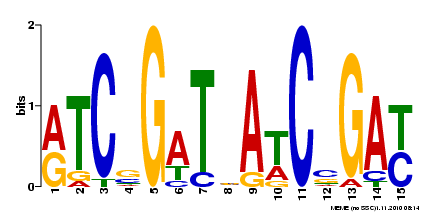

---
title: "Notebook - motif discovery for WhiH"
author: "SG"
date: "November 01, 2016"
output:
  html_document:
    css: style.css
    toc: true
    toc_depth: 3
    toc_float: true
---
<link href="style.css" rel="stylesheet">

```{r setup, include=FALSE}
knitr::opts_chunk$set(echo = TRUE)
```

This is description of results obtained during motif discovery after extracting sequence regions from S. venezuelae genome [(Gen-Bank accession number NC_018750)](https://www.ncbi.nlm.nih.gov/nuccore/NC_018750) based on ChIP-seq peak data. Full project description can be found  [here](https://docs.google.com/document/d/1ovCNDeNRCVAEbYnFg1xPN2Wg67dJ2bQ9shSsmo14nLc/edit)

***
# Results & Notes
## 2016-11-14 Comparison of all peaks and top 10% most significant peaks motifs

### Preparation of input for MEME
Input for [MEME-ChIP](http://meme-suite.org/tools/meme-chip) was generated via same python script (*seq_extractor.py*), with same settings (*length 500 with the peak in the middle*) except input peaks tab-file.  
Command for all peaks regions generation:
```
$python3 bin/seq_extractor.py -l 500 -g data/2016-10-26_Check/FR845719_1.fasta -i data/WhiH_regulon_FLAG_All.csv
```
Command for 10% of most significant peaks regions generation:
```
$python3 bin/seq_extractor.py -l 500 -g data/2016-10-26_Check/FR845719_1.fasta -i data/WhiH_regulon_FLAG_Top10per.csv
```

***

### MEME-Chip input settings
All defaults, except *Input the motifs section* - selection:  
> Prokaryote DNA  
> Combined Prokaryotes


#### Citations from [MEME-ChIP tutorial](http://www.nature.com/nprot/journal/v9/n6/full/nprot.2014.083.html):  

> MEME-ChIP uses two de novo motif discovery algorithms with complementary strengths and weaknesses: MEME is highly specific but slower, whereas DREME is less specific but faster. The algorithms are coupled with a motif enrichment algorithm, CentriMo, which is highly sensitive but operates only on previously identified motifs. MEME-ChIP synthesizes the results of these three algorithms by clustering the discovered and enriched motifs according to their similarity.   
> SpaMo - is able to infer physical interactions between the given TF and TFs bound at neighbouring sites at the DNA interface.

***

### MEME-ChIP output

Category | All Peaks ranges (349 peaks) | Top 10% significant (36 peaks)
---------|------------------------------|-------------------------------
MEME Motifs | [](2016-10-28/all_peaks_MEME_chip/meme-chip.html) | [](2016-10-26/top_10_MEME_chip/meme-chip.html)
e-value | **1.6e-64** | 4.2e-33
**CentriMo results** |  [link](2016-10-28/all_peaks_MEME_chip/centrimo_out/centrimo.html) | [link](2016-10-26/top_10_MEME_chip/centrimo_out/centrimo.html) 
E-value | **7.6e-60** | 3.2e-20
Region Matches | 170 out of 349 (49%) | **30 out of 36 (83%)**
~~**DREME results**~~ - high e-value| [](2016-10-28/all_peaks_MEME_chip/dreme_out/dreme.html)  \n e-value - 2.5e-004| N/A
~~**TOMTOM results**~~ - based on DREME results| [link](2016-10-28/all_peaks_MEME_chip/dreme_tomtom_out/tomtom.html) | N/A
**FIMO results** p-value<0.0001 | [207 motif occurences](2016-10-28/all_peaks_MEME_chip/fimo_out_1/fimo.html) in 349 500bp-long regions| [54 motif occurences](2016-10-26/top_10_MEME_chip/fimo_out_1/fimo.html) in 36 500bp-long regions
~~**SpaMo results**~~ (finds related neighbors motifs - not relevant for this study)| [link](2016-10-28/all_peaks_MEME_chip/spamo_out_1/spamo.html) | [link](2016-10-26/top_10_MEME_chip/spamo_out_1/spamo.html)


### Previous motiff based on DNaseI footprinting


***

## 2016-11-17 Review with Klas

* DREME results should be disregarded, because of very low significance and no real match with MEME motif.
* ~~Another DREME run can be done with 50 - 100 ranges just to check if result is better~~ - does not help (2016-11-29)
* Reverse motif from top-10% peaks is almost identical to both all-peaks MEME motif and motif discovered from DNaseI foot-printing
* Transcriptomics data should be used from the peak file in order to get ranked lists of of most influenced genes for selected (significant motifs)


## 2016-11-18 In-depth analysis of [MEME-ChIP tutorial](http://www.nature.com/nprot/journal/v9/n6/full/nprot.2014.083.html)

The size 500pb and center positioning of the peaks are fully supported and suggested by MEME-ChIP protocol. So overall results are correct with very small room for improvement.

***

###Options to try for even better output

* The 'Use a custom background?' field allows you to upload a custom background model file (1 or 2 or 3 order background Markov Models)
* Restricting the search to palindromes (check the 'look for palindromes only' box) can increase MEME's sensitivity to such motifs
* By default, CentriMo ignores sequences that do not contain a match to a motif with a score of at least 5 bits. To find only strong matches increase this threshold by using the 'Score' field.

## 2016-11-19 Analysis of discovered motif occurance in whole genome

Discovered by MEME motif can be fed into FIMO (Find Individual Motif Occurrences) tool in the [same suit](http://meme-suite.org//tools/fimo)

And to [MCAST](http://meme-suite.org//tools/mcast), which is more advanced   

> MCAST uses a hidden Markov model to search DNA sequences for regions that are enriched with occurrences of one or more of the given motifs. Thus, MCAST is designed to scan chromosomes to detect cis-regulatory modules containing a known collection of cofactor motifs. Compared with MAST and MCAST, FIMO is simpler and more general. FIMO only assigns scores to individual motif occurrences; it makes no attempt to assign scores to joint occurrences of motifs, to sequence regions or to complete sequences. FIMO is thus a general-purpose tool for identifying individual candidate binding sites or protein motifs.

### Procedure

* Input motif discovered previously by MEME-ChIP in "MEME Motif Format" (can be done directly from the MEME results)
* Input database, where to look for motif - S. venezuelae genome [(Gen-Bank accession number NC_018750)](https://www.ncbi.nlm.nih.gov/nuccore/NC_018750)

### Abundance results

|   Result   |   "All-Peaks" motif   |   "Top-10" motif   |
|:-----------|:----------------------|:-------------------|
| **FIMO** p-value<0.0001| [1076 motif occurences](2016-11-18/all_peaks/fimo.html) in whole genome | [756 motif occurences](2016-11-18/top_10/fimo.html) in whole genome |
| **MCAST** p-value<0.0005 | [20 motif occurences](2016-11-18/all_peaks/mcast.html) in whole genome | [12 motif occurences](2016-11-18/top_10/mcast.html) in whole genome |
| Previous **FIMO** p-value<0.0001 | [207 motif occurences](2016-10-28/all_peaks_MEME_chip/fimo_out_1/fimo.html) in 349 "500bp-long" regions| [54 motif occurences](2016-10-26/top_10_MEME_chip/fimo_out_1/fimo.html) in 36 "500bp-long" regions |
| *FIMO net of non ChIP-seq regions* | 869 | 702 |

### Interpretation

#### Graphs

```{r index_all_peaks, echo=FALSE, fig.height=9, fig.width=15}
# all peak analysis
fimo <- read.csv('2016-11-18/all_peaks/fimo.txt', sep='\t')
fimo$logs <- -log10(fimo$p.value)
# add matches from MCAST
mcast <- read.csv('2016-11-18/all_peaks/mcast.txt', sep='\t')

fimo$mcast <- match(fimo$start,mcast$start)
fimo$mcast[!is.na(fimo$mcast)] <- fimo$logs[!is.na(fimo$mcast)]
# add matches from Centrimo
centrimo <- read.csv('2016-11-18/all_peaks/centrimo.txt')

fimo$centrimo_full_match <- c(NA)
totMathes <- 0
rangeExtantion <- 100
for (count1 in 1:length(centrimo$Centrimo_Reg_Matches)) {
  for (count2 in 1:length(fimo$logs)) {
    if (centrimo$Centrimo_Reg_Matches[count1] >= (fimo$start[count2] - rangeExtantion)
        && centrimo$Centrimo_Reg_Matches[count1] <= (fimo$stop[count2] + rangeExtantion)){
      fimo$centrimo_full_match[count2] = fimo$logs[count2]
      
      totMathes = totMathes + 1
      break;
    }
  }

}
cat(totMathes, "CentriMo regions in all FIMO out of", length(centrimo$Centrimo_Reg_Matches), 
    "with", rangeExtantion ,"range extention value")
#plot all results
plot(fimo$logs, type = 'l', main="'All peaks' motif FIMO matches vs MCAST vs CentriMo", 
     ylab = "-log of p-value", xlab = "index in FIMO")
points(fimo$mcast, col='red')
points(fimo$centrimo_full_match, col='blue',pch=3)
legend(x='topright',legend = c('FIMO','MCAST','CentriMo'), lty=c(1,0,0),pch = c(NA,1,3), col=c('black','red','blue'))

```

***

```{r index_top10_peaks, echo=FALSE, fig.height=9, fig.width=15}
# all peak analysis
fimo <- read.csv('2016-11-18/top_10/fimo.txt', sep='\t')
fimo$logs <- -log10(fimo$p.value)
# add matches from MCAST
mcast <- read.csv('2016-11-18/top_10/mcast.txt', sep='\t')

fimo$mcast <- match(fimo$start,mcast$start)
fimo$mcast[!is.na(fimo$mcast)] <- fimo$logs[!is.na(fimo$mcast)]
# add matches from Centrimo
centrimo <- read.csv('2016-11-18/top_10/centrimo.txt')

fimo$centrimo_full_match <- c(NA)
totMathes <- 0
rangeExtantion <- 100
for (count1 in 1:length(centrimo$Centrimo_Reg_Matches)) {
  for (count2 in 1:length(fimo$logs)) {
    if (centrimo$Centrimo_Reg_Matches[count1] >= (fimo$start[count2] - rangeExtantion)
        && centrimo$Centrimo_Reg_Matches[count1] <= (fimo$stop[count2] + rangeExtantion)){
      fimo$centrimo_full_match[count2] = fimo$logs[count2]
      
      totMathes = totMathes + 1
      break;
    }
  }

}
cat(totMathes, "CentriMo regions in all FIMO out of", length(centrimo$Centrimo_Reg_Matches), 
    "with", rangeExtantion ,"range extention value")
#plot all results
plot(fimo$logs, type = 'l', main="'Top 10% peaks' motif FIMO matches vs MCAST vs CentriMo", 
     ylab = "-log of p-value", xlab = "index in FIMO")
points(fimo$mcast, col='red')
points(fimo$centrimo_full_match, col='blue',pch=3)
legend(x='topright',legend = c('FIMO','MCAST','CentriMo'), lty=c(1,0,0),pch = c(NA,1,3), col=c('black','red','blue'))

```


#### Conclusions
* MCAST is very specific to input motif model and uses Markov model to calculate overall score of match, that is why it so few of them.
* FIMO uses simple algorithm for finding matches to motif, and since our motif is not very specific it finds a lot of the matches. Still it finds less matches for more specific motif discovered only from significant peaks -  756 vs. 1076.
* Based on the graphs my suggestion is to change FIMO p-value threshold to e-5 in order to get about 150 - 200 most significant matches of the motif.
* In contrast to GACAC motif, discovered for WhiA and WhiB, which has ~15000 occurrences in *S. venezuelae* genome, figures above are not that bad.

***

## 2016-11-28 Review of MEME alternatives to confirm analysis

* __[PREDetector 2.0](http://predetector.fsc.ulg.ac.be/)__ - updated version to predict regulated genes based on the matrix (motif) not ChIP-seq data
* __[ChIPMunk](http://opera.autosome.ru/chipmunk/discovery/mono/new)__ - simpler motif discoverer - PWM-based motif discovery present but no Word-based motif discovery, Motif enrichment analysis (new motifs only for known). **WEB SERVICE IS DOWN CURRENTLY**
* __[Peak-motifs](http://rsat01.biologie.ens.fr/rsa-tools/peak-motifs_form.cgi)__ - almost as powerful as MEME with all characteristics ChipMunk lacks

__Verdict__: run same ChiP-seq data set with both services, and then conduct further analyses with PREDetector to get "real positions of the motif in genome" and list of regulated genes based on motif matrix not just peaks file transcriptomics.

# Next steps

Last update: 2016-11-30   

* ~~review all the tutorials and examples for MEME-ChIP and define set of optimal settings for final test~~
* perform analysis of the same data with other suit, e.g. ChIPMunk
* ~~check possibility to convert discovered motifs into HMM-profile (contact Markus)~~
* run full analysis with option to reduce background and search only for palindromes and select best motif
* get statistical data on motif abundance (specificity) in total genome (with HMM-profile if possible). And with PREDetector 2.0
* compare available transcriptomics data for most significant motif based positions with non significant - permutation test
